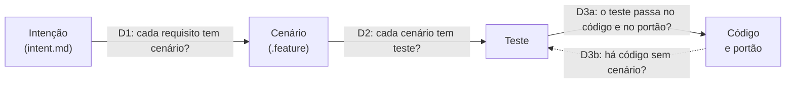

# O ciclo default do SEJA

> Guia em português, em voz controlada: frases curtas, uma ideia por frase e termos fixos. Os comandos ficam em inglês, como no harness. As regras completas estão nas referências citadas no fim.

## O que mudou

Numa tarefa com código, o `/plan` agora começa por uma conversa. Eu pergunto o que você quer, nas suas palavras. Depois eu escrevo o que entendi, e você aprova. Só então eu escrevo o plano.

No `/implement`, cada cenário vira um teste que falha antes de o código existir. Depois eu escrevo o código até o teste passar. No fim, eu guardo um retrato do que foi entregue.

No `/reflect`, eu mostro onde a sua intenção se perdeu, degrau por degrau. Eu também digo o que não consegui medir, e por quê.

## Por que mudou

O código que eu escrevo pode estar errado sem estar quebrado. Ele roda, os testes passam, e mesmo assim não é o que você pediu. Por isso a sua intenção passa por uma escada antes de virar código. Em cada degrau dá para ver o que se perdeu.

## Termos fixos

| Termo | O que é |
|---|---|
| grill | a entrevista em que eu pergunto o que você quer |
| intenção | a lista de requisitos que você aprovou, em `features/<slug>/intent.md` |
| specify | a fase em que eu escrevo os cenários e o que entendi |
| cenário | um exemplo de uso, escrito num arquivo `.feature`, que vira teste |
| retradução | o que eu entendi, em primeira pessoa, com exemplos; é isto que você aprova |
| degrau | a passagem de uma forma da intenção para a seguinte |
| retrato | o estado da feature congelado no fim do `/implement` |
| não medido | o que eu não consegui verificar, sempre com o motivo |

## A escada

| Degrau | O que ele pergunta | Quem olha | Onde fica |
|---|---|---|---|
| D1, intenção para cenário | cada requisito tem um cenário? | você aprova a retradução; quem lê código aprova o `.feature` | `intent.md` e `*.feature` |
| D2, cenário para teste | cada cenário virou teste? | a máquina | os testes e o relatório do runner |
| D3a, teste para código | o teste passa no código final e no portão? | a máquina; quem programa, se quiser | `gate.json` |
| D3b, código sem cenário | há código novo que nenhum cenário exercita? | a máquina; quem programa, se quiser | a cobertura dos cenários |

Cada degrau tem três estados: coberto, descoberto e não medido. Eu nunca junto os degraus num número só. O que não foi medido aparece ao lado, com o motivo.

## O que você faz em cada fase

1. **Pedir.** Você escreve `/plan` e o seu pedido. Eu faço perguntas curtas, poucas de cada vez.
2. **Aprovar a lista.** Eu mostro os requisitos e o que eu não vou fazer. Você aprova, ajusta ou descarta.
3. **Aprovar a mensagem.** Eu mostro o que entendi, com um exemplo por requisito. Você aprova ou pede ajuste.
4. **O contrato.** Quem lê código aprova o arquivo `.feature`. Se ninguém lê código, diga isso: eu registro e mostro depois.
5. **O plano.** Cada passo do plano cita os cenários que entrega. Se o plano for recusado, eu corrijo sozinho.
6. **A construção.** No `/implement`, eu escrevo um teste que falha, depois o código. Você não precisa fazer nada.
7. **A demonstração.** No fim, eu conto cada cenário como demonstrado, não demonstrado ou não medido.
8. **As perguntas.** Às vezes eu pergunto: "Se o código fizesse outra coisa, nenhum cenário perceberia. Isso importa para você?"
9. **A reflexão.** No `/reflect`, eu mostro o que ficou entre o seu pedido e o que existe. Você diz "é isso" ou "não é isso".

## Comandos

| Comando | O que faz |
|---|---|
| `/plan "<pedido>"` | grill, specify e plano, nesta ordem |
| `/plan --grill [<slug>]` | só a entrevista; escreve só o `intent.md` |
| `/plan --specify [<slug>]` | só os cenários, a retradução e as duas aprovações |
| `/implement <id>` | teste que falha por cenário, depois o código; no fim, o retrato |
| `/implement <id> --pipeline` | também simplifica o código e reforça os testes; só se você pedir |
| `/reflect` | a divergência por degrau, ao lado da sua reflexão |
| `/explain drift ladder [<slug>]` | a mesma divergência, sem a reflexão |

## Como pular a escada, com motivo

- Uma proposta rápida: `/plan --light`. Ela não passa pela escada.
- Uma tarefa sem código, como documentação: a grill faz uma pergunta só. O plano registra `Specify: skipped` com o motivo.
- Um roadmap: `/plan --roadmap`. O documento do roadmap segue o formato antigo.

Não existe chave para desligar o ciclo. Uma chave escondida mudaria a medida da escada sem deixar registro.

## Quando algo bloqueia

**"Os cenários voltaram a rascunho."** A entrevista foi reaberta, ou um cenário mudou depois da aprovação. Eu troco o campo para rascunho sozinho. Peça nova aprovação com `/plan --specify <slug>`.

**"Os cenários estão desatualizados: refaça a specify."** O `/implement` para antes de construir. A aprovação não vale mais para o que está no disco. Refaça a specify e rode o `/implement` de novo.

**O plano foi recusado.** Um passo muda o comportamento sem cenário. Ou um cenário aprovado ficou sem passo. Ou os cenários mudaram depois do plano. Eu corrijo o plano; você só vê a recusa se eu não conseguir.

**Eu parei e pedi ajuda.** Depois de três tentativas numa fase, eu paro. Eu mostro quatro saídas: ajustar o cenário, você assumir o passo, aceitar como parcial, ou tentar mais uma vez. Eu nunca ofereço afrouxar o portão.

**O portão me barrou entre o teste e o código.** O teste vermelho é esperado no meio do passo. O hook de parada pode barrar a pausa até três vezes; depois ele libera. Responda "continue" e eu sigo.

## Como atualizar

Rode `/seja-setup --upgrade`. Nada muda no que já existe: seus planos antigos continuam válidos para sempre. Nada novo é perguntado até você pedir código numa feature nova. Os novos checks dizem "nada a verificar" enquanto não há `features/`.

Num projeto Python, o plugin de relatório dos cenários só é atualizado se já estava instalado. Se ele não estava, a atualização não o cria. O `/implement` o instala na primeira vez que precisar.

## Para quem lê código

- Plano novo sai `plan_format_version: 2`, com `Feature: <slug>` e `Specify: approved (rev N)` no cabeçalho.
- Cada passo tem `Scenarios:` com chaves `<slug>/<arquivo>.feature::<nome>`, ou `N/A (motivo)`.
- `check_plan_scenarios.py` recusa passo sem cenário, cenário sem passo, cenários velhos e tarefa pulada com teste.
- `check_specify.py --status` é a fonte de verdade da aprovação; o campo `scenarios:` é só o valor no disco.
- O retrato fica em `features/<slug>/drift/M1.json` e nunca é sobrescrito; o estado atual é o M2.
- O relatório usa o registro sem número técnico quando `scenarios_contract_by: ninguem`, ou quando alguém pede.

Referências: `.claude/references/general/extended-cycle-contract.md` (CYC), `grill-phase.md` (GRL), `specify-phase.md` (SPC), `plan-from-scenarios.md` (PFS), `implement-test-first.md` (ITF), `drift-metric.md` (DRM) e `drift-report.md` (DRP).
