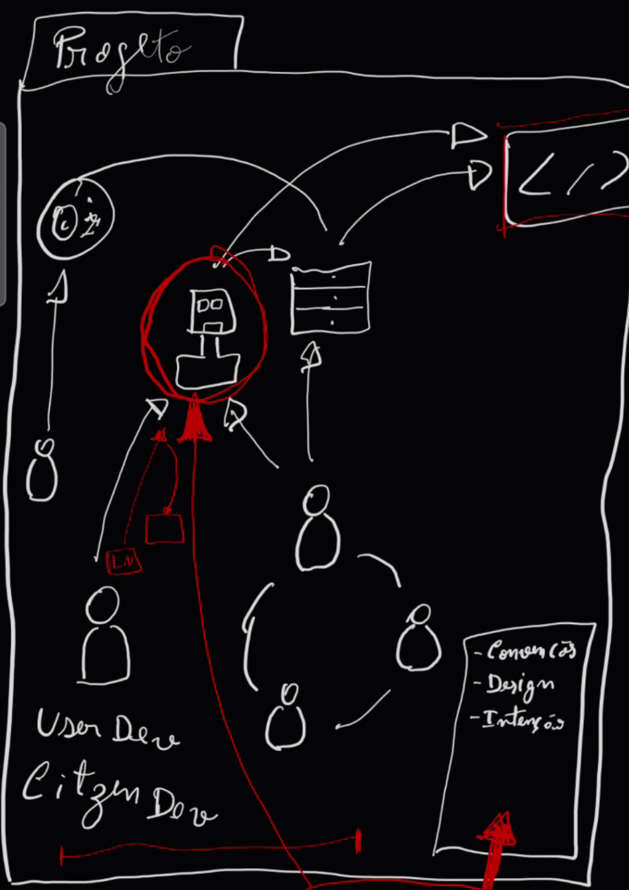
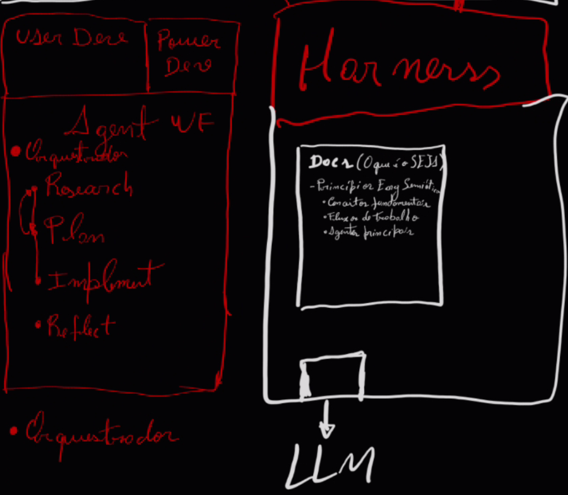

# DESIGN INTENT -- open-seja

<!-- maintained-by: human (designer) -->

> Arquivo unificado de intenção do open-seja: a intenção de trabalho (§0-§17), a fundamentação teórica de que ela decorre (dentro do §3), as decisões validadas com a justificativa preservada (`## Decisions`, formato DDR) e o changelog cronológico (`## CHANGELOG`).
>
> **Classificação**: `Human (markers)`. A prosa é de autoria humana. Agentes podem escrever marcadores `STATUS` nas seções §1-§17, nas jornadas JM-TB-NNN do §15 e nas entradas `### D-NNN:`, e apensar linhas ao `## CHANGELOG`, sempre via `apply_marker.py` e após confirmação explícita no mesmo turno.
>
> **Postura epistêmica**: tudo aqui é leitura corrente e provisória, no registro abdutivo que o próprio SEJA adota (ver `docs/foundations.md`). Hipóteses são marcadas como tal (`H-NNN`) e carregam o que as confirmaria ou refutaria. Não confundir hipótese registrada com decisão tomada: hipóteses vivem no §3; só decisões entram em `## Decisions`.
>
> **IDs estáveis**: princípios `P-NNN`, hipóteses `H-NNN`, questões abertas `Q-NNN`, decisões `D-NNN`, jornadas `JM-TB-NNN`, requisitos `REQ-TYPE-NNN` (REQ-ENT, REQ-PERM, REQ-UX, REQ-MC, REQ-JM, REQ-I18N, REQ-VAL, REQ-DELTA). D-NNN e REQ-TYPE-NNN são ortogonais: decisões registram *por que*; REQs identificam *o que* precisa existir.
>
> **Máquina de estados STATUS**: `proposed -> implemented -> established -> superseded`.
>
> **Idioma**: pt-BR, língua de trabalho das sessões de design. A documentação pública em `docs/` é en-US; a tradução desta fundamentação segue aberta (`Q-005`).
>
> **Origem**: semeado por `/design` em 2026-10-05 a partir de `_output/tmp/design-rascunho-as-intended-2026-10-05.md`, fundindo `product-design/seja-as-intended.md` neste arquivo (`Q-006` fechada: fundir). A fundamentação está no §3 com a numeração original (1.x, 2.x) preservada, para que citações externas como "1.2.4" e "2.8" continuem resolvendo.

---

## 0. Planned Changes

| Target Version | Change Summary | Motivation / Rationale |
|---|---|---|
| v0.11 | Ciclo default com fases grill e specify dentro do `/plan`, teste-primeiro por cenário no `/implement`, divergência por degrau no `/reflect` (roadmap-000006, H-009) -- STATUS: intended | Decompor a intenção em representações progressivamente formais (intenção detalhada -> cenários -> testes -> código) para que o as-coded divirja menos do as-intended, com a divergência medida por degrau e não só no fim. |
| v0.11 | Retradução em primeira pessoa como objeto de aprovação do citizen no specify e no REFLECT; `.feature` como contrato aprovado pelo power dev -- STATUS: intended | Features são contratos endereçáveis, não signos; o citizen aprova a mensagem (D-004). |
| v0.11 | Voz controlada (STE100) como voz padrão de `/explain`, `/communicate`, `/document`; `--html` autocontido -- STATUS: intended (plan-000074 do ledger do pesquisador) | O citizen lê em frases curtas e termos fixos. |
| v0.12+ | Preset `apprentice` (iniciantes em programa de formação) gerado a partir do open-seja pinado, dependência unidirecional preset -> open-seja -- STATUS: intended (D-003) | Ponto discreto da escala H-001 (Q-002) sem bifurcar o ciclo; comparabilidade de artefatos entre instâncias. |
| futuro | SEJA como serviço (`seja-mcp`, H-007) -- STATUS: intended, parado | Rumo de arquitetura; o ciclo consome o harness como ele estiver. |

---

## 1. Platform Purpose

O open-seja é a distribuição de acesso aberto do SEJA (Semiotic Engineering Journeys with Agents). Instalado num projeto de software, ele dá ao Claude Code um ciclo curto, PLAN -> BUILD -> REFLECT, em que a intenção é escrita antes do código e comparada com o que foi construído, cada passo de implementação só conta como feito quando um portão determinístico responde PASS, e cada fase termina com um espelho oferecido ao designer.

É para dois públicos. O primeiro são desenvolvedores ao longo de uma escala contínua de literacia de código (H-001): do citizen dev, que tem a intenção e o domínio do problema mas não lê código, ao power dev, que lê código fluentemente e quer aceleração, controle e rastreabilidade. O segundo são pesquisadores que estudam o harness como objeto: a pergunta que ele serve é como o sistema comunica ao humano as intenções que realizou, e se essa comunicação é reconstruível por quem a recebe.

O problema que resolve: desenvolvimento assistido por IA é um problema de comunicação projetada (P-001, P-002). Quando um agente produz o código a partir de uma intenção dita em linguagem natural, a tradução pode estar errada sem estar quebrada, e o humano que não lê código não tem como saber. O open-seja torna a intenção um signo endereçável (H-002), mede a deriva entre o que se pretendia e o que existe, e devolve ao humano, no registro que ele decodifica, o que o preposto entendeu e construiu (P-003).

O SEJA não é um gerenciador de tarefas para agentes, nem uma camada de processo sobre o Claude Code. Ele é uma aposta teórica: a de que os métodos da engenharia semiótica, construídos para a interação humano-computador, se transferem para a interação humano-agente-código com poder explicativo intacto. A fundamentação dessa aposta está no §3; quem lê o SEJA de fora tende a ver uma coleção de convenções arbitrárias, e quem lê a partir dela vê um sistema de signos desenhado.

### Design Philosophy

- **O artefato é uma mensagem, não um produto** (P-001): cada arquivo que o harness ajuda a produzir é andaime para a comunicação designer -> usuário.
- **O dev fala, o robô produz, as ferramentas apoiam o robô** (P-002): o preposto do designer deixou de ser estático e compõe a fala no momento do uso.
- **O receptor não é único** (H-001): para o citizen dev, o código não pode ser a mensagem; o harness produz os signos metalinguísticos que falam sobre ele.
- **Há um caminho de volta** (P-003): o robô devolve ao humano o que entendeu e construiu; a retradução é obrigatória no polo citizen e eletiva no polo power (H-003).
- **As convenções são um sistema de signos projetado, não estilo** (P-004): marcadores, classificações de autoria e IDs dizem de quem é a voz em cada arquivo.
- **Validar antes de comunicar** (P-005): `/critique` sempre precede `/document` e `/communicate`.
- **Skill orquestra, agente executa** (P-006, P-007, H-004): o orquestrador é o preposto; os agentes são o vocabulário; a composição varia com a posição do humano na escala.
- **PASS é resultado de ferramenta, não frase** (H-008): prosa no prompt não é plano de controle; o limiar só se move por mão humana.
- **Tudo aqui é hipótese numerada com condição de refutação**: o SEJA aplica a si mesmo o raciocínio abdutivo que declara adotar.

---

## 2. Entity Hierarchy

Duas hierarquias paralelas: a **estrutura do harness** (o que existe) e a **escada de representações** (intended, roadmap-000006).

```
Projeto com o harness instalado
└── Intenção (product-design/)
    ├── product-design-as-intended.md   (voz humana; agentes marcam; inclui a fundamentação P, H, Q)
    ├── constitution.md, standards.md, conventions.md
    └── product-design-as-coded.md      (voz do agente; regenerado)
└── Ledger (_output/)
    └── Artefato com ID global (research, plan, roadmap, proposal, reflection, communication, qa-log)
        └── Plano
            └── Step (Files, Verify, Tests, Traces; Scenarios em v2 [intended])
                └── Resultado do portão (gate JSON por step)
└── Harness (.claude/)
    ├── Skill (orquestra; pre-skill e post-skill envolvem toda invocação)
    │   └── Agente (avaliador | gerador | executor; contexto isolado)
    └── Scripts de verificação (check_*.py, run_all_checks.py, gate)
```

```
[intended] Feature (features/<slug>/)
└── intent.md         (REQ-<slug>-NNN; "Nas suas palavras"; Fora do escopo; Premissas; Para que; Modelo e termos; serve:)
    └── *.feature     (cenário com @REQ-<slug>-NNN; contrato)
        └── teste executável (vermelho pelo motivo certo, depois verde)
            └── código + gate.json (perímetro da feature)
```

<!-- REQ-ENT-001 -->
### Projeto

- **Representa**: um repositório de software onde o open-seja foi instalado por `/seja-setup`.
- **Regra de domínio**: sem `product-design-as-intended.md` não há ciclo; `/design` precede o primeiro `/plan` (D-002).

<!-- REQ-ENT-002 -->
### Intenção

- **Representa**: o que o designer quer, em arquivo. Três estados: as-conceived (na cabeça, sem artefato), as-intended (registrado), as-coded (o que existe) (H-005).
- **Regra**: as-intended e as-coded ficam separados de propósito; a distância é a deriva, e `/explain drift` a reconcilia.

<!-- REQ-ENT-003 -->
### Artefato do ledger

- **Representa**: a saída de uma skill, com ID sequencial global reservado por `reserve_id.py`.
- **Regra**: imutável depois de criado; correção é por apensamento (revoked/superseded com motivo), nunca por reescrita.

<!-- REQ-ENT-004 -->
### Plano e Step

- **Representa**: compromisso de construção; cada step declara arquivos, verificação, testes e intenções que atende (`Traces:`).
- **Regra**: em BUILD, step só conta como feito com PASS do portão; o `/critique` do fim mede o que escapou.

<!-- REQ-ENT-005 -->
### Skill e Agente

- **Representa**: a skill conduz a conversa e decide a composição; o agente executa um papel sobre um tipo de artefato, em contexto isolado.
- **Regra**: o usuário nunca invoca um agente diretamente (P-006).

<!-- REQ-ENT-006 -->
### Feature [intended]

- **Representa**: a unidade de medida da divergência por degrau; nunca apagada (git é a recuperação).
- **Regra**: a feature é o perímetro de medição; fora dele é `legado: não medido`.

---

## 3. Domain-Specific Concepts

### Glossário

- **Preposto do designer**: a voz do designer atravessando o sistema no momento do uso; aqui, generativo (P-002).
- **Mensagem de metacomunicação**: "eis meu entendimento de quem você é, o que quer, de que modo, por quê; eis o sistema que projetei e como usá-lo".
- **Retradução (mão de volta)**: o preposto devolve ao humano o que entendeu e construiu, no registro que ele decodifica (P-003).
- **Escala citizen <-> power**: eixo de literacia de código, ortogonal a BLD/SHP/GRD e L1-L3 (H-001, Q-002).
- **Deriva**: distância entre as-intended e as-coded; cidadã de primeira classe (H-002).
- **Portão determinístico**: lint, tipos, testes com cobertura por ramo, CRAP nas funções tocadas, contratos de dependência e, na rodada lenta, mutação; PASS é resultado de ferramenta (H-008).
- **Ratchet e baseline**: o limiar só se move por mão humana; o agente não aceita baseline nem pula o portão.
- **Espelhos por fase**: o plano contado a uma audiência (PLAN) e a deriva medida (BUILD), oferecidos, nunca impostos.
- **Três registros de Schön**: na-ação (justificativa de cada opção), sobre-a-ação (nota por step e por skill), sobre-a-prática (`/reflect`, palavras literais).
- **Hipótese H-NNN**: enunciado com o que a confirmaria e o que a refutaria; não é decisão.
- **Classificações de autoria**: Human, Human (markers), Human/Agent, Agent; dizem de quem é a voz em cada arquivo (P-004, Q-007).
- **Escada de representações [intended]**: brief -> intent.md -> .feature -> teste -> código + gate, com divergência por degrau (H-009).
- **Degrau zero [intended]**: resíduo do brief que não virou requisito nem fora-do-escopo; leitura fora do vetor D.
- **Contrato endereçável [intended]**: o `.feature` é um par expressão-conteúdo convencionalizado entre humano e preposto; REQ IDs e chaves de cenário são endereços, não signos (D-004).
- **Preset [intended]**: perfil gerado a partir do open-seja pinado, com dependência unidirecional preset -> open-seja; não é fork (D-003).

### Fundamentação

> Texto migrado literalmente de `product-design/seja-as-intended.md` (seções 1 e 2) em 2026-10-05. A numeração 1.x e 2.x é a original. As figuras ficam em `docs/`.

### Parte 1 -- Princípios da engenharia semiótica

O SEJA não é um gerenciador de tarefas para agentes, nem uma camada de processo sobre
o Claude Code. Ele é uma aposta teórica: a de que **desenvolvimento de software assistido
por IA é um problema de comunicação projetada**, e que os métodos da engenharia semiótica
-- construídos para a interação humano-computador -- se transferem para a interação
humano-agente-código com poder explicativo intacto.

Esta seção registra os princípios que sustentam essa aposta. Ela vem primeiro porque
todo o resto do harness (o sistema de marcadores, o ciclo de vida das skills, o catálogo
de agentes) é consequência dela, e não o contrário. Quem lê o SEJA de fora tende a ver
uma coleção de convenções arbitrárias; quem lê a partir daqui vê um sistema de signos
desenhado.

---

#### 1.1 Conceitos fundamentais

##### 1.1.1 Software como comunicação projetada

<!-- P-001 -->
**P-001 -- O artefato é uma mensagem, não um produto.**

A premissa central da engenharia semiótica (de Souza 2005, cap. 1 e 3) é que interação
humano-computador é um caso particular de comunicação humana mediada por computador. A
interface não é onde o usuário opera a máquina; é onde o **designer fala com o usuário**
através de um substituto que fala em seu nome no momento do uso.

De Souza chama esse substituto de **preposto do designer** (*designer's deputy*). O
preposto não é o sistema: é a voz do designer atravessando o sistema, num momento em que
o designer não está na sala. Cada rótulo, cada mensagem de erro, cada valor-padrão é uma
fala do preposto. Quando o usuário não sabe o que fazer, o preposto tropeçou no texto --
e isso é uma **quebra de comunicação**, diagnosticável como quebras de comunicação são
diagnosticáveis.

A consequência para o SEJA é direta: cada artefato que o harness ajuda a produzir
(`product-design-as-intended.md`, os marcadores, os planos, os relatórios) é andaime
para essa comunicação. Não é sobrecarga de gestão. É um modo de ser mais deliberado
sobre a mensagem que se está entregando.

##### 1.1.2 O terceiro interlocutor: o robô entra na cena

<!-- P-002 -->
**P-002 -- A relação dev↔código passou a ser mediada por um agente que produz código.**

Partimos do desenho clássico da atividade de desenvolvimento (artigo de Abrahão --
ver `Q-001`, referência a completar), em que o desenvolvedor age sobre o código
*apoiado por ferramentas*: editor, compilador, depurador, testes. A ferramenta amplia
o alcance do dev, mas não fala por ele.

O desenho que estamos propondo desloca esse arranjo. Hoje temos:

```
  [ dev ] ──fala──> [ robô ] ──produz──> [ código ]
                        │
                        └──apoiado por──> [ ferramentas ]
```



> **Figura 1 -- Design do software project** (desenho de origem, sessão de design de 2026-08-26;
> crédito: os designers). Leitura elemento a elemento no `Apêndice B`.

<!-- P-002a -->
**Ressalva que o desenho impõe (`P-002a`).** A Figura 1 mostra **duas setas entrando no
`</>`**: uma vinda do robô e outra vinda do lado humano. Isto é, o robô **não substituiu**
o time na produção de código -- ele se somou a ele. O esquema linear acima
(`dev → robô → código`) é o caminho *novo*, não o único. O arranjo real é de **duas vias
concorrentes de autoria sobre o mesmo artefato**, e isso levanta uma pergunta semiótica
que o esquema linear esconde: quando dois prepostos escrevem no mesmo texto, de quem é
a voz que o leitor está lendo? Ver `Q-007`.

Três mudanças, todas com consequência semiótica:

1. **O dev fala.** A entrada primária deixa de ser edição direta e passa a ser
   linguagem natural -- isto é, passa a ser *mensagem*, com toda a ambiguidade,
   pressuposto e implicatura que mensagens carregam.
2. **O robô produz.** O código deixa de ser autoria direta do humano e passa a ser
   um artefato *interpretado a partir de uma intenção*. Alguém traduziu, e a tradução
   pode estar errada sem estar quebrada.
3. **As ferramentas apoiam o robô, não o humano.** O compilador, os testes e o
   linter passam a ser instrumentos do preposto, não do designer.

O ponto teórico é que o preposto do designer **deixou de ser estático**. No modelo de
2005, o preposto é código escrito de antemão que repete um script fixo em tempo de uso.
Aqui o preposto *compõe a fala no momento do uso*. Isso não invalida a teoria -- amplia
a superfície em que ela morde. A extensão da engenharia semiótica ao pipeline de
desenvolvimento já havia sido feita em SigniFYI (de Souza et al. 2016, *Software
Developers as Users*); o que acrescentamos é que o desenvolvedor agora tem um preposto
próprio, generativo, entre ele e o artefato.

##### 1.1.3 O receptor não é único: a escala citizen dev ↔ power dev

<!-- H-001 -->
**H-001 (hipótese) -- Existe uma escala contínua de desenvolvedores, ancorada em
literacia de código, e o harness precisa se adequar à posição do humano que assiste.**

Se o robô produz código a partir de uma intenção, a pergunta seguinte é: **o humano
consegue ler o que voltou?** A resposta divide a população de usuários em algo que não
é uma categoria, mas um contínuo:

| Polo | Quem é | Relação com o código | O que espera do robô |
|---|---|---|---|
| **User / citizen dev** | Tem intenção e domínio do problema; não lê código | O código é opaco -- não é signo legível para ele | Que a computabilidade do robô produza algo que **traduza de volta** o código implementado para uma linguagem adequada a ele |
| ... contínuo ... | | | |
| **Power dev** | Especialista em tecnologia | O código é o sistema de signos primário; lê fluentemente | Que o robô acelere, não que traduza; quer controle, rastreabilidade e governança |

A consequência de projeto é forte e vale enunciar sozinha:

> **Para o citizen dev, o código não pode ser a mensagem.**
> Se o receptor não decodifica o sistema de signos em que o artefato está expresso,
> entregar o artefato não é comunicar. O preposto tem obrigação de emitir a mensagem
> num registro que o receptor decodifique -- e essa obrigação é *constitutiva*,
> não um recurso de conveniência.

Em vocabulário da engenharia semiótica: para o power dev, o código funciona como signo
**estático** legível diretamente; para o citizen dev, o código só chega através de signos
**metalinguísticos** que falam *sobre* ele. O harness é responsável por produzir esses
signos metalinguísticos, e essa responsabilidade cresce à medida que se desce a escala.

<!-- Q-002 -->
**Relação com os eixos que o SEJA já tem (`Q-002`, aberta).** O harness já estratifica
audiência de duas maneiras: **famílias de papel** (BLD Builders / SHP Shapers /
GRD Guardians), que classificam por *função*, e **níveis de expertise** (L1 Contributor /
L2 Expert / L3 Leader), que classificam por *senioridade dentro da função*.

A escala de H-001 **não é nenhuma das duas**. Ela classifica por *literacia de código*,
e cruza as outras: existe SHP sênior (L3) que não lê código, e existe BLD júnior (L1)
que lê. Nossa leitura corrente é que se trata de um **terceiro eixo, ortogonal**, e que
ele é o único dos três que determina *em que sistema de signos a mensagem de volta pode
ser escrita*. Isso o torna o eixo mais consequente dos três para efeito de comunicação,
ainda que o menos representado no harness hoje.

Fica aberto: (a) se o eixo é de fato ortogonal ou se colapsa parcialmente em BLD/SHP/GRD;
(b) quantos pontos discretos a escala precisa ter para ser operacional -- um contínuo não
é implementável, e dois polos provavelmente são grosseiros demais.

##### 1.1.4 A mão de volta: metacomunicação em dois sentidos

<!-- P-003 -->
**P-003 -- O SEJA tem um caminho de retorno, e ele é parte da mensagem.**

O template de metacomunicação (de Souza 2005, cap. 1 p.25 e cap. 3 p.84) é uma fala em
primeira pessoa do designer ao usuário: *"Eis meu entendimento de quem você é, eis o que
aprendi que você quer, eis o sistema que construí para você, eis como você pode ou deve
usá-lo."* Barbosa et al. (2021) o estenderam no **EMT** com quatro dimensões de ciclo de
vida e questões éticas explícitas.

Sob P-002 e H-001, esse template ganha um segundo trajeto. Não basta o humano declarar
intenção ao robô; o robô precisa **devolver ao humano uma declaração do que entendeu e
do que construiu**, no registro que o humano decodifica:

```
    intenção  ──────────────────>  código executável
   (humano)      tradução do robô      (artefato)
       ^                                   │
       └───────── retradução ──────────────┘
              (signos metalinguísticos)
```

A retradução é o que permite ao citizen dev **exercer autoria sem ler código**. Sem ela,
ele não tem como verificar se o artefato corresponde à sua intenção, e a relação vira
delegação cega -- exatamente o oposto do que a engenharia semiótica considera
comunicação bem-sucedida.

Parte dessa mão de volta já existe no harness (`/explain`, `/communicate` com seus
segmentos de audiência, `/document`), mas hoje ela é **eletiva**: o usuário precisa
pedir. A intenção registrada aqui é que, para posições baixas da escala H-001, a
retradução deixe de ser eletiva.

##### 1.1.5 Sistemas de signos e o sistema de marcadores

<!-- P-004 -->
**P-004 -- As convenções do SEJA são um sistema de significação projetado, não estilo.**

De Souza, a partir de Peirce e Eco, classifica signos de interface em três classes
(de Souza 2005, cap. 4; de Souza e Leitão 2009, pp.19-20):

- **Estáticos** -- lidos num único instante: um rótulo, um leiaute, um ícone.
- **Dinâmicos** -- emergem da interação: uma transição de estado, uma confirmação.
- **Metalinguísticos** -- explicam os outros dois: ajuda, mensagens de erro, tooltips.

E, de Eco (1976), a distinção entre **sistema de significação** -- o repertório
socialmente convencionado de pares expressão-conteúdo disponível a um grupo -- e
**processo de comunicação** -- o que alguém faz ao montar uma mensagem intencional a
partir desse repertório. O vão entre os dois é onde mora a invenção.

O sistema de marcadores do SEJA (`STATUS`, `ESTABLISHED`, `CHANGELOG_APPEND`, e os
oito `REQ-TYPE-NNN`) é lido aqui como **sistema de significação projetado** nesse
sentido exato: um vocabulário pequeno e convencionado para eventos de ciclo de vida,
com forma fixa (`apply_marker.py` a impõe) e lugar fixo (`check_human_markers_only.py`
rejeita escrita fora do padrão). Ele existe para que designer e agente possam falar
sobre movimento de intenção sem nenhum dos dois ter que reescrever prosa.

As quatro classificações de arquivo -- `Human`, `Human (markers)`, `Agent`,
`Human / Agent` -- são o mesmo mecanismo aplicado à **autoria**: elas dizem de quem é
a voz em cada arquivo do repositório, e impedem que as vozes se misturem.

##### 1.1.6 Computabilidade da intenção

<!-- H-002 -->
**H-002 (hipótese) -- O SEJA pode ser um bom instrumento para embasar a computabilidade
dos agentes na medida em que eles transformam intenções em código executável.**

A afirmação por trás da hipótese é que **intenção só é computável quando é signo**. Uma
intenção dita em prosa livre não é operável por um agente: não há como verificar se foi
atendida, nem detectar quando deixou de ser. A aposta do SEJA é que três propriedades,
juntas, tornam intenção computável:

1. **Expressão em sistema de signos fixo** -- a intenção mora em
   `product-design-as-intended.md` sob estrutura conhecida, com IDs estáveis
   (`REQ-TYPE-NNN`, `D-NNN`) que um programa consegue endereçar.
2. **Rastreabilidade até o código** -- passos de plano declaram quais requisitos
   satisfazem, e `check_plan_coverage.py` verifica que nada foi silenciosamente pulado.
   A intenção deixa de ser preâmbulo e passa a ser contrato verificável.
3. **Deriva como cidadã de primeira classe** -- o par as-intended / as-coded, com
   `/explain drift`, faz do descolamento entre intenção e implementação algo
   *detectável e reconciliável*, em vez de algo que simplesmente acontece.

Se a hipótese se sustenta, o SEJA não é apenas um harness para o dev: é o **substrato
sobre o qual um agente consegue raciocinar sobre intenção** -- e, por consequência,
consegue produzir a retradução de P-003 com fundamento, porque sabe *a que intenção*
cada trecho de código responde.

O que a confirmaria: agentes conseguindo responder "esta mudança atende a qual intenção
declarada?" e "o que na intenção ainda não tem código?" sem inspeção humana. O que a
refutaria: a rastreabilidade se degradando na prática a ponto de os marcadores virarem
ritual -- exatamente a crítica de Eraut (1994) que `docs/foundations.md` já registra
contra os andaimes de reflexão.

---

#### 1.2 Fluxos de trabalho

##### 1.2.1 O caminho canônico

<!-- P-005 -->
**P-005 -- Validar antes de comunicar.**

O SEJA roda um único ciclo canônico em torno de qualquer engajamento:

```
/research (ou /explain) > /design | /plan > /implement > /critique > /document | /communicate > /reflect
```

Leia `|` como "escolha um, conforme a intenção" e `>` como "e então".

| Etapa | Skills | Propósito |
|---|---|---|
| **Investigar** | `/research` ou `/explain` | fazer uma pergunta, ou entender como algo funciona |
| **Dar forma** | `/design` ou `/plan` | mudar a intenção (design) ou comprometer-se com uma construção (plan) |
| **Construir** | `/implement` | executar um plano aprovado |
| **Validar** | `/critique` | portão de qualidade antes que qualquer coisa voltada ao leitor saia |
| **Comunicar** | `/document` ou `/communicate` | artefatos para leitor, **somente após validação** |
| **Fechar o ciclo** | `/reflect` | registrar o que o turno ensinou antes do próximo começar |

O invariante que dá nome ao princípio é o único portão rígido: `/critique` sempre precede
`/document` e `/communicate`. Nada sai do envelope sem ter sido validado. Isso é uma
posição semiótica, não de processo: uma mensagem entregue sem validação é o preposto
falando sem saber se o que diz é verdade.

A entrada natural é `/research` ou `/explain` -- investigar o que se vai mudar. A saída
dessa investigação flui para `/design` se a **intenção** precisa mudar, ou para `/plan`
se a intenção está assentada e o que falta é construir. A única exceção é a primeira
iteração de um projeto novo, em que `/seja-setup` instala o harness e entrega a
`/design`.

##### 1.2.2 O par as-intended / as-coded e a deriva

O harness mantém dois documentos em tensão deliberada:

- **`product-design-as-intended.md`** -- o que se pretende. Voz humana, agentes só
  marcam. Estados de ciclo de vida: `proposed -> implemented -> established -> superseded`.
- **`product-design-as-coded.md`** -- o que existe. Voz do agente, reconstruído após
  implementação.

A distância entre os dois é a **deriva**, e `/explain drift` é o fluxo de alinhamento
que a reconcilia. Manter os dois arquivos separados é uma escolha: fundir intenção e
implementação num documento só apaga precisamente a informação mais valiosa -- *o que
ainda não é*.

##### 1.2.3 Os fluxos precisam variar ao longo da escala H-001

<!-- H-003 -->
**H-003 (hipótese, decorrente de H-001) -- O caminho canônico é o mesmo, mas a
superfície de contato e a obrigatoriedade da retradução variam com a posição do humano
na escala citizen↔power.**

Leitura corrente de como o ciclo se apresenta em cada polo:

| | **Citizen / user dev** | **Power dev** |
|---|---|---|
| Superfície primária | `/design`, `/explain`, `/communicate` | `/plan`, `/implement`, `/critique` |
| `/plan` e `/implement` | rodam com mais autonomia; o plano é resumido em prosa de intenção, não em passos técnicos | são o objeto central; o plano é revisado passo a passo |
| Retradução (P-003) | **obrigatória** -- é como ele verifica o resultado | eletiva; o código já é legível |
| Papel do `/critique` | prova de que a intenção foi atendida | prova de qualidade técnica e conformidade |
| Papel dos marcadores | invisíveis; o valor é a rastreabilidade automática | ferramenta de governança usada diretamente |
| Risco dominante | delegação cega -- aceitar o que não se consegue verificar | ritual -- produzir a forma do processo sem o conteúdo |

O ciclo não se bifurca. O que muda é **onde o humano toca nele** e **em que registro o
preposto fala de volta**. Essa é a formulação concreta de "o harness e seus agentes
precisam se adequar ao dev que estão assistindo".

##### 1.2.4 Os três registros de reflexão

O SEJA carrega os três registros de Schön (1983) como andaimes concretos, deliberadamente
mínimos para que a encenação não compense o esforço:

- **Reflexão-na-ação** -- a justificativa curta que acompanha cada opção em toda
  `AskUserQuestion`: transforma uma bifurcação silenciosa numa deliberação visível.
- **Reflexão-sobre-a-ação** -- a nota breve ao fim de `/implement`, `/plan`, `/design`
  e `/document`: o que de fato aconteceu, o que desviou do plano, sobre o que se está
  menos seguro agora do que no início.
- **Reflexão-sobre-a-prática** -- a skill `/reflect`, que ancora numa escolha de
  artefatos, pergunta se a lente é o **produto** ou a **prática**, e registra as
  palavras do designer **literalmente**, sem prescrever mudança.

O par natural de Schön aqui é a **abdução** de Peirce: observar um fato surpreendente,
levantar a hipótese que o explicaria se verdadeira, e sustentá-la provisoriamente até
que evidência melhor chegue. É por isso que as hipóteses deste documento são numeradas
e carregam condições de refutação -- é o modo de raciocínio que o SEJA declara adotar,
aplicado a si mesmo.

---

#### 1.3 Agentes principais

##### 1.3.1 Skill orquestra, agente executa

<!-- P-006 -->
**P-006 -- A skill é o orquestrador; o agente é a responsabilidade única.**

A distinção estrutural do harness:

- Uma **skill** é um `SKILL.md` sob `.claude/skills/<nome>/`, invocada por barra
  (`/plan`). Ela conduz a conversa, segura o estado do ciclo de vida, faz as perguntas
  ao humano e **decide quais agentes compor**.
- Um **agente** é um prompt sob `.claude/agents/`, que executa **um papel sobre um tipo
  de artefato**, em janela de contexto isolada, com conjunto de ferramentas definido.
  Recebe entradas da skill que o chamou e devolve artefato estruturado. O usuário
  **nunca** invoca um agente diretamente.

Duas skills internas -- `pre-skill` e `post-skill` -- envolvem toda invocação de skill
de usuário. São elas que fazem os andaimes de reflexão de 1.2.4 acontecerem de forma
consistente e auditável, em vez de dependerem de disciplina.

##### 1.3.2 Os três papéis

<!-- P-007 -->
**P-007 -- Todo agente é avaliador, gerador ou executor.**

**Avaliadores** -- revisam artefatos sob uma lente de qualidade e devolvem achados
estruturados:

| Agente | Papel |
|---|---|
| `code-reviewer` | revisa diffs contra 16 perspectivas de engenharia e design, com profundidade graduada |
| `plan-reviewer` | revisa um plano em processo de duas fases graduado por complexidade |
| `research-reviewer` | avalia decisões de design, questões abertas e trade-offs |
| `council-debate` | debate estruturado entre cinco arquétipos fixos mais 0-2 especialistas do tema |
| `semiotic-inspector` | conduz avaliação SIM da comunicabilidade nas três classes de signo |
| `harness-health-evaluator` | roda 9 checagens de autodiagnóstico do harness |
| `standards-checker` | agrega todos os scripts de validação num relatório de conformidade |
| `test-runner` | roda as suítes e classifica falhas com contexto |
| `migration-validator` | valida integridade de cadeia de migrações |

**Geradores** -- produzem artefatos autocontidos a partir de entradas bem definidas:

| Agente | Papel |
|---|---|
| `explanation-generator` | explicações de comportamento, código e modelo de dados |
| `architecture-explainer` | estrutura do sistema, fronteiras, decisões-chave |
| `evolution-explainer` | como uma funcionalidade chegou ao estado atual, a partir do histórico de planos |
| `document-generator` | documentação por tipo (readme, api-reference, ddr, changelog, ...) |
| `communication-generator` | material para um segmento de audiência (EVL, CLT, USR, ACD) |
| `onboarding-generator` | plano de integração por família de papel e nível |
| `test-plan-generator` | plano de teste manual estruturado |

**Executores** -- não estão catalogados: são construídos **dinamicamente** pelo modo
automático de `/implement`, a partir dos metadados dos passos do plano. São a ponta que
efetivamente transforma intenção em código.

Vale notar que o `council-debate` é a operacionalização explícita da abdução: vários
especialistas rodando leituras abdutivas concorrentes sobre a mesma questão, postos em
desacordo estruturado, para que a síntese entregue carregue as contra-leituras visíveis.
A intenção é não fingir que uma recomendação é a única plausível.

##### 1.3.3 O orquestrador que compõe



> **Figura 2 -- Design do harness** (desenho de origem, sessão de design de 2026-08-26; crédito: os designers).
> Leitura elemento a elemento no `Apêndice B`.

<!-- H-004 -->
**H-004 (hipótese) -- O agente de workflow possui um orquestrador capaz de chamar
diversos agentes e compor o que for necessário para que o agente de IA-dev assista o
humano no desenvolvimento de software.**

O desenho já responde parte da hipótese antes de a discutirmos: na Figura 2, **`User Dev`
e `Power Dev` não estão dentro do `Agent WF` -- estão como cabeçalho *sobre* ele**. Os
dois polos são desenhados como *entrada* do agente de workflow, não como um caso de uso
dele. Essa é exatamente a formulação que H-004 defende, e ela chegou pelo desenho antes
de chegar pelo argumento.

A leitura: nenhum agente isolado assiste o desenvolvedor. O que assiste é a **composição**
-- e o orquestrador é quem decide a composição. Uma passagem por `/critique` pode compor
`standards-checker`, `test-runner`, `code-reviewer` e `semiotic-inspector`; uma passagem
por `/research --deep` compõe `research-reviewer` e `council-debate`.

A consequência de projeto, e a razão pela qual esta hipótese fecha a seção 1: **o
orquestrador é o lugar onde a adequação ao dev (H-001, H-003) se realiza.** Se a
composição é decidida em tempo de execução, então a posição do humano na escala
citizen↔power é uma **entrada legítima da decisão de composição** -- e não uma
bifurcação que precisaria ser costurada em cada skill separadamente.

Dito de outro modo: o orquestrador é o preposto. Os agentes são o vocabulário de que ele
dispõe. A mensagem é o que ele monta com eles, para este humano, neste turno.

O que a confirmaria: composições visivelmente diferentes para a mesma solicitação vinda
de pontos diferentes da escala, com retradução automática no polo citizen. O que a
refutaria: a adequação exigindo bifurcação dentro de cada skill, o que indicaria que o
orquestrador não é o ponto de variação certo.

---

### Parte 2 -- De AI-assisted a AI-Native: a hipótese

A literatura sobre desenvolvimento assistido por IA investiga majoritariamente a
comunicação humano -> IA: como o desenvolvedor instrui, corrige e restringe o modelo.
A pergunta de pesquisa que este documento serve aponta na direção inversa: **como o
sistema comunica ao humano as intenções que realizou, e se essa comunicação é
reconstruível por quem a recebe.** É P-003 (a mão de volta) e H-001 (o receptor não é
único) ditas como pergunta -- e é o que a engenharia semiótica chama de
comunicabilidade, aplicada ao preposto generativo de P-002.

A hipótese de trabalho é que o ciclo de desenvolvimento se reorganiza em três fases --
PLAN, BUILD, REFLECT -- atravessadas por uma faixa de retorno contínua. Esta seção
lê cada elemento contra a seção 1: o que já estava lá, o que se refina, o que é novo.
Os termos *AI-assisted* e *AI-native* seguem Hassan et al. (2026), que os usam para
nomear SE 2.0 e SE 3.0.

#### 2.1 Três fases como grão grosso do caminho canônico

PLAN, BUILD e REFLECT não são um ciclo novo; são o caminho canônico de P-005 em grão
mais grosso:

| Fase | Skills de P-005 | O que a fase materializa |
|---|---|---|
| **PLAN** | `/research` ou `/explain` > `/design` ou `/plan` | intenção e design. A intenção não nasce pronta: prototipar -> observar -> ajustar, antes de travar o design |
| **BUILD** | `/implement`, com `/critique` **dentro** | o incremento, a partir da intenção registrada; refinar e refatorar são parte da fase, não uma fase depois |
| **REFLECT** | `/reflect` | o que o episódio ensinou, antes do próximo começar |

Duas precisões que evitam contradição com P-005. Primeira: `/critique` não desaparece --
ele vive dentro de BUILD, e o portão "validar antes de comunicar" permanece. Segunda: o
"documentar" que acontece dentro de BUILD é a nota de reflexão-sobre-a-ação do post-skill
e a regeneração do as-coded (voz do agente); não é `/document`, que produz artefato
para leitor e continua vindo depois de `/critique`.

Isto responde Q-008: o `Agent WF` de quatro itens da Figura 2 era este grão grosso, não
uma proposta de ciclo sem validação. Registrado em D-001.

#### 2.2 A faixa transversal EXPLAIN / COMMUNICATE

Atravessando as três fases corre uma faixa de retorno, e ela não é uma coisa só:

- **EXPLAIN** é o retorno IA -> humano: o que o preposto entendeu e construiu, no registro
  que o receptor decodifica (P-003). O instrumento é a deriva (H-002, item 3): a
  comparação contínua entre as-coded e as-intended. Mas a deriva é o instrumento, não o
  EXPLAIN -- o EXPLAIN é o retorno cuja *surpresa* dispara o REFLECT.
- **COMMUNICATE** é entre pessoas, mesmo quando mediado por IA: o que o time diz ao
  cliente, ao revisor, ao próximo desenvolvedor.

Duas distinções mantêm a faixa coerente com o que a seção 1 já fixou:

1. **Contínuo para EXPLAIN, gated para COMMUNICATE.** A faixa é contínua para o retorno
   IA -> humano, que não sai do envelope, e para a *preparação* de COMMUNICATE. Cada
   emissão pessoa -> pessoa continua passando por `/critique` (P-005). É uma posição
   semiótica, não de processo: uma mensagem entregue sem validação é o preposto falando
   sem saber se o que diz é verdade.
2. **EXPLAIN-deriva é agnóstico de audiência; EXPLAIN-retradução não.** A comparação
   as-coded x as-intended roda sempre e custa pouco. O registro em que o resultado é
   devolvido depende da posição do humano na escala citizen <-> power (H-003):
   obrigatório num polo, eletivo no outro.

A faixa é uma resposta *candidata* a Q-004 (etapa do post-skill que compara e devolve).
Q-004 permanece aberta até o mecanismo rodar. Abre Q-011.

#### 2.3 A seta REDESIGN: deriva como detecção precoce

Quando o EXPLAIN surpreende -- o que voltou não é o que se pretendia -- a seta REDESIGN
volta da faixa ao PLAN. Isto já existe em H-002 (deriva como cidadã de primeira classe,
reconciliada por `/explain drift`). O que a seta muda é o **gatilho**: hoje a deriva é
periódica (verificação a cada 14 dias) e eletiva; detecção precoce pede que ela dispare
por evento, ao fim de cada `/implement`. Esta é a consequência verificável desta
subseção -- e é estado intencional, não atual.

#### 2.4 As-conceived / as-intended / as-coded: duas lacunas

<!-- H-005 -->
**H-005 (hipótese) -- Há três estados da intenção, não dois, e só a segunda lacuna
entre eles é verificável por máquina.**

O par de 1.2.2 (as-intended / as-coded, dois arquivos em tensão) esconde um terceiro
termo. Há o que o designer **concebeu** (na cabeça, sem artefato), o que ele
**registrou** (`product-design-as-intended.md`, planos, briefs -- o as-intended, que
continua sendo o arquivo) e o que **existe** (as-coded). Isso dá duas lacunas:

| Lacuna | Entre | Verificável por máquina? | Como aparece |
|---|---|---|---|
| 1 | as-conceived -> as-intended | não | o registro não diz o que se queria; várias realizações cabem no mesmo texto (subespecificação; ver Q-007) |
| 2 | as-intended -> as-coded | sim (`/explain drift`, `check_plan_coverage`) | a implementação diverge do registro |

A lacuna 1 não é verificável, mas é **elicitável**: a surpresa no EXPLAIN (2.2) é a
lacuna 1 detectada através de artefatos da lacuna 2 -- o código voltou fiel ao registro
e ainda assim não era o que se queria. O microloop de PLAN (prototipar -> observar ->
ajustar) é a sonda humana da mesma lacuna, antes de travar o design.

O que a confirmaria: `/explain drift` produzindo, com alguma frequência, propostas de
`/design` (mudar o registro) e não só de `/plan` (mudar o código). O que a refutaria:
toda deriva tratada como bug de código e nunca como bug de expressão -- as surpresas no
EXPLAIN nunca resultando em mudança do as-intended.

Nota de nomenclatura: o termo "as-conceived" para o estado tácito é escolha deste
documento; formulações anteriores usaram outro nome para o termo do meio. O arquivo
as-intended mantém o sentido que tem em 1.2.2 e H-002.

#### 2.5 Governança, proveniência, rastreabilidade

A terceira perna da hipótese -- quem altera o quê, de onde veio cada item, cada decisão
ligada à sua intenção -- não acrescenta princípio novo. É P-004 (o sistema de marcadores
e as quatro classificações de autoria dizem de quem é a voz em cada arquivo) e H-002
(IDs estáveis endereçáveis; passos de plano declarando que requisito satisfazem). O que
a hipótese faz é nomeá-la como condição: sem rastreabilidade, o EXPLAIN de 2.2 não sabe
*a que intenção* cada trecho responde, e a retradução vira opinião. Q-007 (de quem é a
voz quando duas vias de autoria escrevem no mesmo texto) continua sendo a questão
aberta desta perna.

#### 2.6 Os três registros de Schön relidos nas três fases

A seção 1.2.4 localizou os três registros de Schön em andaimes concretos. A hipótese os
relê sobre o desenho das três fases:

| Registro | Onde vive no desenho | Andaime |
|---|---|---|
| **Reflexão-na-ação** | a faixa EXPLAIN / COMMUNICATE, e os microloops dentro de PLAN (prototipar -> observar -> ajustar) e BUILD (testar -> validar -> refinar -> refatorar) | a justificativa das `AskUserQuestion`; o `/critique` dentro do `/implement`; a comparação contínua da faixa |
| **Reflexão-sobre-a-ação** | o painel REFLECT, depois do episódio | a nota do post-skill; `/reflect` com lente *produto* |
| **Reflexão-sobre-a-prática** | o harness que evolui (2.7) | `/reflect` com lente *prática*, alimentando as skills |

Isto refina 1.2.4 em dois pontos: a reflexão-na-ação deixa de ser só a justificativa
da `AskUserQuestion` e passa a incluir os microloops de PLAN e BUILD; e o `/reflect`
se desdobra pelas duas lentes que a skill já oferece.

#### 2.7 O harness que evolui da reflexão do time

<!-- H-006 -->
**H-006 (hipótese) -- As skills e regras do harness podem evoluir a partir dos
registros de reflexão-sobre-a-prática do time, e não apenas de traces de execução do
agente.**

Hoje nenhuma skill lê os registros de `/reflect` como entrada: `/reflect` escreve, o
post-skill indexa, e nada consome. A hipótese está, portanto, não refutada por ausência
de mecanismo -- o que é diferente de confirmada.

A referência mais próxima é o WikiSkill (Tang et al., 2026), que co-evolui
skills reutilizáveis de agente com uma base de conhecimento persistente em três camadas
de escrita: traces de execução imutáveis; um wiki de padrões que acumula e nunca reseta;
skills com atualizações reversíveis. As três camadas mapeiam sobre o SEJA: `_output/`
(imutável, por convenção de artefato), `product-design/` (acumula, `Human (markers)`)
e `.claude/skills` (reversível). O contraste é o que importa: lá, quem propõe e quem
mantém são agentes, e a fonte é a experiência do agente; aqui a fonte são palavras
humanas registradas literalmente, e a mudança de skill passa por autoria humana. É o
mesmo eixo da pergunta de pesquisa desta seção -- humano -> IA no WikiSkill, IA -> humano
aqui -- aplicado ao próprio harness.

O que a confirmaria: uma mudança de skill cujo plano cita um registro de reflexão como
origem (rastreabilidade de P-004). O que a refutaria: reflexões acumuladas sem nenhum
plano que as cite -- a crítica de Eraut (1994) a andaimes que viram ritual, já
registrada em H-002. Abre Q-013.

#### 2.8 As três fases com validação por passo: o portão determinístico

D-001 leu o `Agent WF` de quatro itens como o grão grosso do caminho canônico, com o
`/critique` dentro de BUILD. Curto é a superfície que o leitor vê, não o conteúdo.
Falta dizer o que torna confiável a validação dentro de BUILD quando quem constrói é
um agente que escreve mais rápido do que o humano revisa.

<!-- H-008 -->
**H-008 (hipótese) -- PLAN -> BUILD -> REFLECT pode ser oferecido como caminho de
entrada ao agente de workflow sem perder o que P-005 protege, desde que: (a) dentro de
BUILD, cada passo do agente só conta como feito quando um portão determinístico responde
PASS -- a validação que 2.1 põe dentro de BUILD passa a acontecer passo a passo, como
resultado de ferramenta, antes do `/critique`; e (b) a reflexão atravessa as fases, e
cada fase termina com um espelho oferecido ao designer: no PLAN, o plano contado a uma
audiência; no BUILD, a deriva entre o que se pretendia e o que existe.**

A condição (a) é a frase "PASS é resultado de ferramenta, não frase": prosa no prompt
não é plano de controle. O portão reúne verificações que não negociam -- lint e tipos,
testes com cobertura por ramo, complexidade ponderada pela cobertura (CRAP) nas funções
tocadas, contratos de dependência entre módulos e, numa rodada mais lenta, testes de
mutação. O limiar só se move por mão humana (ratchet a partir do baseline): o agente fica
no laço interno, o humano no externo, dono das restrições.

P-005 continua de pé: `/critique` sempre precede `/document` e `/communicate`. O que a
H-008 muda é o papel do `/critique` no fim de BUILD: ele deixa de ser a primeira
validação e passa a ser a medida do que escapou do portão.

A condição (b) relê 2.6 no grão do passo e no grão da fase. Reflexão-na-ação: a
justificativa de cada `AskUserQuestion` e, no microloop de BUILD, o que muda na
tentativa seguinte a um FAIL. Reflexão-sobre-a-ação: a nota ao fim do `/plan` (1.2.4) e
uma nota curta por passo de BUILD -- o que aconteceu, o que desviou, sobre o que se está
menos seguro -- com o resultado do portão como evidência. Reflexão-sobre-a-prática: o
`/reflect` com lente *prática* (2.6), lendo notas e resultados do portão através de
vários planos -- a entrada de que H-006 precisa.

Os espelhos são o que a nota do agente sobre si mesmo não alcança. O espelho do PLAN é
o plano contado a um segmento (`/communicate`): a retradução de P-003 aplicada à
intenção antes de ela virar código; plano que não sobrevive a ser contado não está
claro. O espelho do BUILD é a deriva entre as-intended e as-coded (`/explain drift`,
com o as-coded regenerado): o portão responde se cada passo foi construído certo; a
deriva responde se o que se construiu era o que se pretendia, e o que se pretendia e
não entrou. Os dois são **oferecidos** ao fim da fase, nunca impostos -- a retradução é
eletiva no polo power (H-003) -- e o `/reflect` registra quando um deles não foi medido.
É assim que a Q-008 se fecha: o ciclo curto não descarta `/communicate` e `/explain`;
ele os internaliza como instrumentos de reflexão de cada fase, e P-005 segue de pé --
o `plan-reviewer` precede o comunicar do plano, e o `/critique` do fim de BUILD precede
o explicar da deriva.

O ciclo tem uma pré-condição: sem `as-intended` não há PLAN -> BUILD -> REFLECT. O
`/design` precede qualquer ciclo, como 2.1 já diz da primeira iteração; não existe modo
degradado em que a deriva não tenha contra o que ser medida.

É um caso de H-004: o orquestrador compõe, por passo, um subagente novo e o portão, e,
por fase, o espelho que o designer aceitar; a composição varia com a escala de H-003
(no polo citizen, a retradução do resultado do portão é obrigatória; no polo power, o
resultado cru basta).

| Medida | Fonte |
|---|---|
| iterações até PASS, por passo | resultado do portão por passo |
| taxa de escape: achados críticos do `/critique` final em código de passo com PASS, por passos com PASS | log do `/critique` x resultado do portão |
| escapes de intenção: itens de deriva (construído sem intenção, intenção não construída) por plano, nos ciclos em que a deriva foi medida | relatório do `/explain drift` após o BUILD |
| sobreviventes de mutação por commit, na rodada lenta | resultado do portão |
| marcadores de evasão acrescentados (skip, xfail, no cover, no mutate) sem motivo registrado | ratchet do portão |
| notas por passo com desvio cujo passo seguinte as cita (nota que age) | nota por passo x passo seguinte |
| espelhos aceitos por fase (comunicação do plano, deriva do BUILD) | registro do `/plan` e do `/implement` no progress file |

Antes do primeiro ciclo medido, o designer fixa e registra (como `D-NNN`) o número
mínimo de planos e os limiares; fixá-los depois de ver os dados invalida a medida. O
que a confirmaria: a taxa de escape abaixo do limiar, marcadores de evasão estáveis, a
maioria das notas com desvio mudando o passo seguinte e, nos ciclos com deriva medida,
escapes de intenção raros. O que a refutaria: (i) a taxa de escape acima do limiar -- o
portão não ocupa o lugar da validação; (ii) evasão ou sobreviventes de mutação crescendo
com o portão em PASS -- o agente otimiza o número, e o ratchet não segura; (iii) notas
por passo que não mudam nenhum passo seguinte -- o ritual que H-003 aponta como risco do
polo power; (iv) escapes de intenção frequentes com o portão em PASS -- o portão prova
correção, não intenção, e o ciclo curto precisa do espelho como passo fixo, não como
oferta.
Registrado em D-002 o que o release faz enquanto a hipótese está em teste.

#### 2.9 A escada de representações (proposta)

<!-- H-009 -->
**H-009 (proposta, filha de H-008) -- se o SEJA decompõe a intenção em linguagem natural em representações progressivamente mais formais (intenção detalhada com REQ IDs -> cenários Gherkin -> testes executáveis -> código) e só implementa depois, o *as-coded* diverge menos do *as-intended* do que no ciclo PLAN -> BUILD -> REFLECT de H-008. A divergência é medida por degrau da escada, não só no fim.**

Texto de origem: roadmap-000006. O ajuste que D-004 fixa: H-009 declara o próprio alcance. A escada é completa para comportamento operacionalizado, com perda declarada de racional, modelo, preferência e crença sobre o usuário; essas categorias são objeto do degrau zero (D0), da auditoria semântica e da retradução julgada pelo citizen, não do vetor D.

O que a refutaria: se, no piloto, ajustes e recusas no specify, escapes de intenção antes do código e mutantes virados em REQ forem todos zero, a aprovação virou ritual, H-009 cai e H-001 volta a pedir adequação por posição na escala.

> **Nota sobre H-007.** O CHANGELOG da fundamentação registra que a hipótese de SEJA como serviço passou a ser H-007 (2026-09-18), mas o texto dela não está neste arquivo nem estava no de origem. Fica como lacuna a redigir; o rumo está no §0 (`seja-mcp`, parado).

### Questões abertas

| ID | Questão | Bloqueia |
|---|---|---|
| `Q-001` | Referência bibliográfica exata do artigo de Abrahão de que partiu o desenho de 1.1.2 -- autor(es), título, veículo, ano. Não foi inventada aqui de propósito. | citação de P-002 |
| `Q-002` | A escala H-001 é ortogonal a BLD/SHP/GRD e L1-L3, ou colapsa parcialmente? Quantos pontos discretos ela precisa para ser operacional? D-003 registra um ponto concreto (`apprentice`) sem fechá-la. | operacionalização de H-001 |
| `Q-003` | Como o harness **detecta** a posição do humano na escala? Declaração explícita no `conventions.md`? Inferência a partir da interação? Escolha por sessão? **Sustentada em aberto por decisão de 2026-08-26 -- ver nota abaixo.** | H-003 |
| `Q-004` | A retradução obrigatória (P-003) é um novo artefato, um novo modo de `/explain`, ou uma etapa do `post-skill`? **Fechada por D-004 (2026-10-05):** é etapa do specify e do REFLECT, não artefato novo nem modo de `/explain`. | P-003 |
| `Q-005` | Este documento fica em pt-BR ou é traduzido para en-US junto com `docs/`? O SEJA é publicado publicamente. **Mantida aberta em 2026-10-05**; o texto segue em pt-BR. | publicação |
| `Q-006` | Relação entre a fundamentação e o `product-design-as-intended.md` no formato §0-§17 do template. **Fechada em 2026-10-05 (`/design`): fundir.** A fundamentação vive no §3 deste arquivo; as hipóteses ficam no §3, e só as decisões entram em `## Decisions`. | estrutura |
| `Q-007` | Duas vias de autoria escrevem no mesmo `</>` (Figura 1). De quem é a voz que o leitor do código está lendo? O harness precisa distinguir trecho de autoria humana de trecho de autoria do preposto? | `P-002a` |
| `Q-008` | O `Agent WF` da Figura 2 lista **Research → Plan → Implement → Reflect** -- um ciclo **reduzido**, sem `/design`, `/critique`, `/document` e `/communicate`. É simplificação do desenho, ou é uma proposta deliberada de ciclo mais curto para o agente de workflow? Se for deliberada, colide com `P-005` (validar antes de comunicar). **Fechada por D-001 (2026-09-18).** Reforçada por H-008 (2026-10-03): o ciclo curto internaliza `/communicate` e `/explain` como espelhos de fase. | `P-005`, `H-004` |
| `Q-009` | "Orquestrador" aparece **duas vezes** na Figura 2: dentro da lista do `Agent WF` e de novo, solto, fora da caixa. São dois níveis de orquestração (um por-workflow e um global), ou é repetição de ênfase? | `H-004` |
| `Q-010` | O círculo com figura no alto à esquerda da Figura 1, alimentado por um humano e ligado ao `</>`, não foi identificado com segurança. O que representa? | leitura da Figura 1 |
| `Q-011` | Como a faixa contínua de EXPLAIN (2.2) respeita o portão de P-005 sem virar ritual -- o que é "preparar" um COMMUNICATE sem emiti-lo? | 2.2, Q-004 |
| `Q-012` | O `semiotic-inspector` avalia signos de interface via SIM. Avaliar a retradução (se a mensagem IA -> humano é reconstruível pelo receptor) pede um modo novo. Qual método -- CEM adaptado? **Resposta parcial (D-004, 2026-10-05):** a retradução é julgada pelo receptor ("é isso / não é isso" por requisito), lógica CEM, registrada em `audit.json`. | pergunta de pesquisa da seção 2 |
| `Q-013` | Qual skill consome os registros de `/reflect` como entrada, e com que regra de escrita sobre `.claude/skills` (reversível? proposta + confirmação humana?) | H-006 |

> **Nota sobre `Q-003`.** Esta questão está **deliberadamente sustentada em aberto**, e
> não meramente sem resposta. A razão é de dependência: não se decide *como detectar* a
> posição de alguém numa escala cujos pontos ainda não foram definidos -- e a granularidade
> da escala é justamente o que `Q-002` mantém em aberto. Fixar um mecanismo de detecção
> agora (campo em `conventions.md`, inferência, escolha por sessão) congelaria por via
> indireta uma resposta a `Q-002` que ainda não temos. Fechar `Q-002` primeiro é o
> caminho; até lá, `H-003` permanece como leitura, sem implementação.

---

## 4. Permission Model

Não há login. O modelo de permissão do open-seja é sobre **quem pode escrever em que arquivo** e **o que o agente não pode fazer**.

### System-Level Roles

<!-- REQ-PERM-001 -->
| Role | Level | Capabilities |
|---|---|---|
| Designer (humano) | owner | Escreve prosa em arquivos Human e Human (markers); aprova marcadores; move o ratchet do portão; aceita ou recusa espelhos |
| Agente (skills e subagentes) | agent | Escreve em `_output/` e em arquivos Agent (as-coded, índices); aplica marcadores via `apply_marker.py` após confirmação; nunca edita prosa Human (markers) |
| Leitor da distribuição | reader | Clona `main` (manifesto exclui `_output/**` e `product-design/conventions.md`), roda `/seja-setup --here` |

### Resource-Level Access

<!-- REQ-PERM-002 -->
| Access Level | Level | Capabilities |
|---|---|---|
| `main` (distribuição) | public-org | Só o que o `tools/publish-manifest.txt` inclui; sem ledger, sem conventions do próprio open-seja |
| `dev` (desenvolvimento) | restricted | Ledger `_output/`, `product-design/` completo, planos do ciclo default |
| Denies ao agente | enforced | `git commit --no-verify` e `gate --accept-baseline` negados por permissão; hooks `Stop` e `PreToolUse` rodam o portão |

> **Rationale:** a única fronteira que importa é a da voz (P-004, Q-007) e a do ratchet (H-008): o humano é o dono das restrições; o agente fica no laço interno.

---

## 5. Content Authoring & Attribution

Duas vias de autoria escrevem no mesmo código (P-002a, Q-007 aberta). O harness distingue a voz por classificação de arquivo e por marcador, não por sistema de atribuição em app. Regras: palavras do designer são registradas literalmente (regra do verbatim); a mensagem de metacomunicação usa "eu" (designer) e "você" (usuário), nunca terceira pessoa; agentes marcam `source: agent (...)` no que escrevem. O open-seja é derivado do SEJA sob CC BY-NC 4.0; a atribuição e o uso do nome estão em `README.md` e `TRADEMARKS.md`.

---

## 6. Content Import & Export

### Import Formats

| Format | Source | Features |
|---|---|---|
| Codebase existente (brownfield) | repositório do usuário | `/seja-setup --here` instala o harness; `/design` registra a intenção a partir do que existe |
| Questionário de design | `/design` | Gera as-intended, constitution, standards, conventions |
| Spec de roadmap | `--from-spec <path>` | Roadmap com waves a partir de arquivo preenchido |
| Palavras do designer | `/reflect`, `--framing metacomm` | Registradas verbatim |

### Export Formats

| Format | Output | Use Case |
|---|---|---|
| Markdown | `_output/**` | Todo artefato do ledger |
| HTML autocontido | `--html` em `/explain`, `/communicate`, `/document` [intended] | Leitura fora do terminal |
| Material por segmento | `/communicate` (EVL, CLT, USR, ACD) | O plano contado a uma audiência (espelho do PLAN) |
| Release | `main` pelo manifesto; tag `vX.Y.Z`; instalador `npx` (não publicado) | Distribuição |

---

## 7. User Community & Localization

### Target Community

Times de desenvolvimento ao longo da escala H-001, do citizen ao power dev, cruzada com as famílias de papel (BLD Builders, SHP Shapers, GRD Guardians) e os níveis L1-L3. Segundo público: pesquisadores de engenharia semiótica e de engenharia de software que estudam o harness como objeto. Instância prevista [intended]: programa de formação de iniciantes (`apprentice`, D-003).

### Localization Design

<!-- REQ-I18N-001 -->
| Aspect | Primary | Secondary |
|---|---|---|
| Sessões de design e fundamentação (§3) | pt-BR | -- |
| `docs/` e README públicos | en-US | pt-BR (Q-005 aberta) |
| Voz ao citizen | voz controlada (frases curtas, termos fixos) [intended] | -- |

> Código, identificadores e mensagens de log em en-US. Q-005 segue aberta: a fundamentação fica em pt-BR até a decisão sobre a publicação.

---

## 8. User Experience Patterns (Domain-Driven)

A interface é a conversa no Claude Code. Padrões próprios:

<!-- REQ-UX-001 -->
- **Decisão com justificativa**: toda `AskUserQuestion` traz, por opção, "Recommended when" e "NOT recommended when" (reflexão-na-ação). Nenhuma opção é pré-aceita por enquadramento.
<!-- REQ-UX-002 -->
- **Files for review** antes de qualquer pergunta que cite artefato já gerado.
<!-- REQ-UX-003 -->
- **Espelho oferecido, nunca imposto**: `/communicate` do plano ao fim do PLAN; `/explain drift` ao fim do BUILD; o `/reflect` registra quando não foram medidos.
<!-- REQ-UX-004 -->
- **PASS como resultado**: o portão devolve achados por função, nunca resumo em prosa.
<!-- REQ-UX-005 -->
- **Progress file** por plano, com nota por step.
<!-- REQ-UX-006 -->
- [intended] **Grill e specify**: entrevista em rodadas curtas, uma ideia por pergunta; aprovação em voz controlada; o citizen aprova a mensagem, o power dev aprova o contrato.

---

## 9. Administrative Domain

### Activity Logging

`_output/briefs.md` (toda invocação de skill), `telemetry.jsonl` (um registro por skill), `conversation-trace.jsonl`, `pending.jsonl` (ações humanas pendentes), `INDEX.md` (catálogo). Git é o log de mudanças.

### Backup & Restore

Git. Artefatos do ledger são imutáveis; não há soft-delete.

### Terms & Conditions

CC BY-NC 4.0 (derivado do SEJA), uso não comercial, sem garantias; nome usado com permissão do detentor da marca.

---

## 10. Validation Constants (Domain)

<!-- REQ-VAL-001 -->
| Constant | Value | Domain Rationale |
|---|---|---|
| CRAP máximo em funções tocadas / teto absoluto | 10 / 30 (`DEFAULT_MAX_TOUCHED`, `DEFAULT_MAX_ABS` do `gate.py`; ratchet a partir do baseline) | Funções minúsculas e cobertas; o limiar desce por mão humana |
| `--fast` do portão | <= 90 s, sem mutação | Portão por step tem de caber no laço interno |
| Rodadas do portão por step | 3, depois PARTIAL com os achados no progress file (`/implement`) | O agente não insiste indefinidamente |
| Pendência vencida / escalada de plano / auto-dismiss | 14 / 30 / 90 dias | Conforme `conventions.md` |
| [intended] Grill: rodadas x perguntas | 5 x 4 | Teto, não alvo; depois devolve a decisão ao citizen |
| [intended] Specify: rodadas de ajuste | 3 | Ajuste repetido indica REQ vago; volta à grill |
| [intended] Voz controlada | 25 palavras por frase; 6 frases por parágrafo | Legibilidade para o citizen |

> CRAP 10/30 e as 3 rodadas conferidos em `gate.py` e em `.claude/skills/implement/SKILL.md` em 2026-10-05. Os 90 s do `--fast` são meta, não valor imposto pelo script.

---

# Part II -- Metacommunication

## 11. Global Metacommunication Vision

"Eu sei que você quer construir software com um agente que escreve mais rápido do que você consegue revisar, e que talvez você não leia o código que ele escreve. Por isso eu peço que você me diga o que quer antes de qualquer código, nas suas palavras, e eu o registro como intenção que uma máquina consegue endereçar. Eu só considero um passo feito quando uma ferramenta, e não uma frase, diz que passou. Ao fim de cada fase eu lhe ofereço um espelho: o plano contado a quem você escolher, e a distância entre o que você pediu e o que existe. E eu lhe devolvo, no registro que você lê, o que entendi, o que construí e o que não construí, para que você exerça autoria sem precisar ler código. Tudo isso é uma aposta que eu numero e me comprometo a refutar se os dados disserem o contrário."

---

## 12. Extended Metacommunication Template Guiding Questions

1. Análise
   1.1. **O que sei sobre você.** Sei que você está em algum ponto de uma escala de literacia de código (H-001), e que isso decide em que sistema de signos eu posso lhe falar de volta. Aprendi isso observando que, para quem não lê código, entregar o código não é comunicar. Não sei ainda quantos pontos a escala tem nem como detectar o seu (Q-002, Q-003, deliberadamente abertas).
   > Personas e cenários de problema: `product-design/ux-research-results.md §1-§4`.
   1.2. **Sobre os outros afetados.** Sei que o seu time, os revisores e os leitores da documentação recebem o que você comunica; por isso nada sai do envelope sem `/critique`. Sei que pesquisadores estudam o que eu faço; por isso registro tudo com ID e proveniência.
   1.3. **Contextos de uso.** Dentro do Claude Code, num repositório seu, local; em `dev` para quem me desenvolve, em `main` para quem me instala.
   1.4. **Questões éticas.** Duas vias de autoria no mesmo código (Q-007): de quem é a voz que o leitor lê? E o risco de delegação cega no polo citizen e de ritual no polo power (H-003).
2. Design
   2.1. **O que projetei para você.** Um ciclo PLAN -> BUILD -> REFLECT com portão determinístico por passo, espelhos por fase e um caminho de volta.
   2.2. **Que objetivos apoio.** Dizer a intenção antes do código; construir com validação por passo; saber o que escapou; refletir antes do próximo turno.
   2.3. **Em que situações.** Em qualquer engajamento de desenvolvimento, do primeiro `/design` ao `/reflect`; com portão quando a stack o tem, sem portão quando não (e eu digo que não medi).
   2.4. **Como usar.** `/seja-setup`, depois `/design` uma vez, depois `/plan`, `/implement`, `/reflect`; aceite ou recuse os espelhos.
   2.5. **Para que não quero que use.** Para pular o portão (`--no-verify`, `--accept-baseline` pelo agente), para editar prosa humana por agente, para tratar hipótese como decisão, para publicar sem `/critique`.
   2.6. **Princípios éticos.** A voz pertence a quem a emitiu; o humano é dono das restrições; o que não foi medido é dito como não medido.
   2.7. **Alinhamento.** Classificações de autoria e marcadores (P-004); ratchet só por mão humana; estados `não medido` sempre visíveis.
3. Prototipação, implementação e avaliação formativa
   3.1. **Como construí.** Skills em Markdown que orquestram agentes em contexto isolado; scripts Python determinísticos de verificação; template de portão por stack.
   3.2. **O que construí para prevenir mau uso.** Hooks `Stop` e `PreToolUse`, denies de permissão, verificador de marcadores humanos, imutabilidade de artefatos.
   3.3. **Para identificar efeitos não antecipados.** Deriva as-intended/as-coded, taxa de escape do `/critique`, notas por step, `/reflect` com palavras literais.
   3.4. **Cenários éticos avaliados.** Agente aceitando baseline; agente editando intenção humana; aprovação do citizen virando ritual ("parece bem").
4. Avaliação contínua
   4.1. **Quanto da visão se reflete no uso.** H-008 ainda não medida; o primeiro ciclo real com portão gera a primeira medida.
   4.2. **Usos não antecipados.** A registrar.
   4.3. **Efeitos.** A registrar.
   4.4. **Questões a tratar por redesign.** Se escapes de intenção forem frequentes com PASS, o espelho deixa de ser oferta e vira passo fixo (refutação iv de H-008).

---

## 13. Solution Representations

### Option A: Solution Scenarios

#### SS-001: O power dev roda um ciclo com portão

- **Persona:** power dev (R-P-001; lê código; quer aceleração e rastreabilidade)
- **Goals:** construir uma feature com validação por passo e saber o que escapou
- **Setting:** repositório Python com o portão instalado; `/design` já feito
- **Design Rationale:** o portão ocupa o lugar da validação dentro de BUILD (H-008); o `/critique` final mede o escape

O dev escreve o brief, o `/plan` gera e revisa o plano, o `/implement` em modo auto roda o portão `--fast` a cada step (até 3 tentativas), o `/critique` cruza achados com steps em PASS, o `/explain drift` é oferecido com o as-coded regenerado, e o `/reflect` registra o que o episódio ensinou e o que não foi medido.

#### SS-002 [intended]: O citizen dev aprova a mensagem, não o código

- **Persona:** citizen dev (R-P-002; tem a intenção; não lê código)
- **Goals:** exercer autoria sem ler código; reconhecer a própria intenção no que voltou
- **Setting:** mesma escada, sem perfil; muda o objeto de aprovação
- **Design Rationale:** para o citizen o código não pode ser a mensagem (H-001); features são contratos, a mensagem é a retradução (D-004)

O citizen responde à grill nas próprias palavras; aprova a lista de requisitos; recebe a retradução em primeira pessoa com exemplos narrados e a lista do que não será feito, e aprova a mensagem; o power dev (ou ele mesmo, em outro papel) aprova o `.feature` como contrato; ao fim, recebe a demonstração por cenário, os mutantes sobreviventes recontados como perguntas e o que ficou `não medido`.

### Option B: User Stories

#### US-001: Intenção antes do código

- **Story:** Como designer, quero registrar a intenção antes do código para que a deriva tenha contra o que ser medida.
- **Acceptance Criteria:**
  - `/plan` recusa partir sem as-intended
  - todo step declara `Traces:`

#### US-002: Passo feito só com PASS

- **Story:** Como power dev, quero que cada passo só conte como feito com PASS para que a validação não dependa da minha velocidade de revisão.
- **Acceptance Criteria:**
  - portão por step
  - no máximo 3 rodadas
  - denies de `--no-verify` e `--accept-baseline`

#### US-003 [intended]: Aprovar o que reconheço

- **Story:** Como citizen dev, quero aprovar o que vai ser construído num texto que eu reconheça, e saber o que não foi construído, para não delegar às cegas.
- **Acceptance Criteria:**
  - retradução com "Nas suas palavras" ao lado
  - ausências enumeradas
  - nenhum número técnico no meu registro

---

## 14. Per-Feature Metacommunication Intentions

| Feature / Flow | Designer Intent | Priority | Source | Last Synced |
|---|---|---|---|---|
<!-- REQ-MC-001 -->
| `/seja-setup` | Eu instalo o harness no seu repositório e lhe entrego ao `/design`, porque sem intenção registrada não há ciclo. | P0 | human | 2026-10-05 00:00 UTC |
<!-- REQ-MC-002 -->
| `/design` | Eu registro, nas suas palavras, quem você é, o que quer e por quê, e os princípios que não negocio, porque tudo o que vem depois é medido contra isso. | P0 | human | 2026-10-05 00:00 UTC |
<!-- REQ-MC-003 -->
| `/plan` | Eu transformo o seu brief num plano com passos rastreáveis à intenção, reviso-o em perspectivas e lhe ofereço contá-lo a uma audiência antes de construir. | P0 | human | 2026-10-05 00:00 UTC |
<!-- REQ-MC-004 -->
| `/implement` com portão por step | Eu só considero um passo feito quando o portão responde PASS, e paro na terceira falha; eu não movo o limiar, você move. | P0 | human | 2026-10-05 00:00 UTC |
<!-- REQ-MC-005 -->
| `/critique` | Eu valido antes de qualquer coisa sair para um leitor, e no fim do BUILD meço o que escapou do portão. | P0 | human | 2026-10-05 00:00 UTC |
<!-- REQ-MC-006 -->
| `/explain drift` (espelho do BUILD) | Eu lhe mostro a distância entre o que você pediu e o que existe, com o as-coded regenerado, e digo o que não medi. | P1 | human | 2026-10-05 00:00 UTC |
<!-- REQ-MC-007 -->
| `/communicate` (espelho do PLAN) | Eu conto o plano a quem você escolher, porque plano que não sobrevive a ser contado não está claro. | P1 | human | 2026-10-05 00:00 UTC |
<!-- REQ-MC-008 -->
| `/reflect` | Eu registro as suas palavras literalmente, sem prescrever mudança, e anoto o que não foi medido. | P1 | human | 2026-10-05 00:00 UTC |
<!-- REQ-MC-009 -->
| Marcadores e classificações de autoria | Eu digo de quem é a voz em cada arquivo e nunca escrevo prosa no lugar de você. | P0 | human | 2026-10-05 00:00 UTC |
<!-- REQ-MC-010 -->
| Hooks e denies | Eu não deixo o agente pular o portão nem aceitar baseline; isso é seu. | P0 | human | 2026-10-05 00:00 UTC |
<!-- REQ-MC-011 -->
| [intended] Grill e specify no `/plan` | Eu pergunto o que você quer, um pouco de cada vez e nas suas palavras, escrevo de volta como requisitos e só sigo para os cenários depois que você aprovar. | P1 | human | 2026-10-05 00:00 UTC |
<!-- REQ-MC-012 -->
| [intended] Retradução como objeto de aprovação | Eu lhe mostro o que entendi e o que vou construir em primeira pessoa, com exemplos; você aprova a mensagem, e o contrato fica para quem lê código. | P1 | human | 2026-10-05 00:00 UTC |
<!-- REQ-MC-013 -->
| [intended] Divergência por degrau | Eu mostro onde a sua intenção se perdeu, degrau a degrau, com o que não medi ao lado, em vez de uma nota única. | P1 | human | 2026-10-05 00:00 UTC |
<!-- REQ-MC-014 -->
| [intended] Preset `apprentice` | Eu me ofereço num perfil gerado a partir de mim, sem bifurcar o ciclo, para quem está aprendendo e precisa de outro registro. | P2 | human | 2026-10-05 00:00 UTC |

---

## 15. Designed User Journeys

> **One-directional flow:** achados de pesquisa em `product-design/ux-research-results.md §5` informam esta seção; esta seção não volta para o arquivo de pesquisa.

<!-- REQ-JM-001 -->
### JM-TB-001: Primeiro ciclo de um power dev com portão

- **Persona:** power dev (R-P-001)
- **Solution Scenario:** SS-001
- **Goal:** uma feature construída com validação por passo e deriva medida
- **Pre-conditions:** `/seja-setup --here` feito; `/design` feito; portão instalado e baseline aceito pelo humano

#### Steps

| # | Action | Touchpoint | User Emotion | Pain Point | Opportunity |
|---|---|---|---|---|---|
| 1 | Escreve o brief e roda `/plan` | Claude Code | focado | brief vago gera plano vago | revisão por perspectivas; espelho do PLAN |
| 2 | Aceita ou recusa contar o plano (`/communicate`) | AskUserQuestion | avaliando | fricção se o plano é trivial | espelho oferecido, nunca imposto |
| 3 | Roda `/implement` em modo auto | subagente por step | confiante | esperar o portão | `--fast` <= 90 s; nota por step |
| 4 | Lê os achados do `/critique` cruzados com PASS | relatório | surpreso ou aliviado | achado crítico em step com PASS | taxa de escape de H-008 |
| 5 | Aceita ou recusa a deriva (`/explain drift`) | AskUserQuestion | curioso | relatório longo | `não medido` sempre visível |
| 6 | `/reflect` | conversa | reflexivo | parecer ritual | palavras literais; o que não foi medido |

#### Post-conditions / Outcomes

Feature em PASS, achados do `/critique` registrados, deriva medida ou registrada como não medida, reflexão gravada.

<!-- REQ-JM-002 -->
### JM-TB-002 [intended]: O citizen dev na escada, aprovando a mensagem

- **Persona:** citizen dev (R-P-002)
- **Solution Scenario:** SS-002
- **Goal:** reconhecer a própria intenção no que foi construído, sem ler código
- **Pre-conditions:** ciclo default do roadmap-000006 entregue; `features/` no projeto

#### Steps

| # | Action | Touchpoint | User Emotion | Pain Point | Opportunity |
|---|---|---|---|---|---|
| 1 | Responde à grill, nas próprias palavras | rodadas curtas | ouvido | perguntas demais | teto de rodadas; "Nas suas palavras" |
| 2 | Aprova a lista de requisitos e o "não faz" | resumo em voz controlada | seguro | aprovar o que não entendeu | critério por requisito em uma frase |
| 3 | Aprova a retradução com exemplos narrados | mensagem em primeira pessoa | reconhecendo | "parece bem" sem ler | exemplos narrados; teste da surpresa |
| 4 | Recebe demonstração por cenário e mutantes recontados | superfície do produto; perguntas | surpreso | mais coisas para olhar | só sobreviventes e cenários marcados por padrão |
| 5 | Marca "é isso / não é isso" por requisito | REFLECT | autor | fricção | alimenta a auditoria semântica |

#### Post-conditions / Outcomes

Requisitos com estado demonstrado / não demonstrado / não medido / fora do escopo; "não é isso" com endereço para a máquina agir.

---

# Part III -- Delta from As-Coded

## 16. Conceptual Design Delta

### New (in as-intended but not in as-coded)

| Section | Element | Description |
|---|---|---|
<!-- REQ-DELTA-001 -->
| §0, §2, §3 | Escada de representações, feature, degrau zero, contrato endereçável | intended; roadmap-000006, H-009, D-004 |
<!-- REQ-DELTA-002 -->
| §0, §3, §14 | Preset `apprentice` | intended; D-003; sem roadmap |
<!-- REQ-DELTA-003 -->
| todas | as-coded | não existe ainda; o primeiro `/implement` após este `/design` o instancia |

### Changed (differs between as-coded and as-intended)

| Section | Element | As-Coded | As-Intended |
|---|---|---|---|
| -- | -- | -- | -- |

### Removed (in as-coded but not in as-intended)

| Section | Element | Reason for Removal |
|---|---|---|
| -- | -- | -- |

---

## 17. Metacommunication Delta

### New Intentions (not yet implemented)

| Feature / Flow | Designer Intent | Priority |
|---|---|---|
<!-- REQ-DELTA-004 -->
| Grill e specify | ver §14 (REQ-MC-011) | P1 |
<!-- REQ-DELTA-005 -->
| Retradução como objeto de aprovação | ver §14 (REQ-MC-012) | P1 |
<!-- REQ-DELTA-006 -->
| Divergência por degrau | ver §14 (REQ-MC-013) | P1 |
<!-- REQ-DELTA-007 -->
| Voz controlada | Eu falo com você em frases curtas e termos fixos. | P1 |
<!-- REQ-DELTA-008 -->
| Preset `apprentice` | ver §14 (REQ-MC-014) | P2 |

### Changed Intentions (implementation differs from intent)

| Feature / Flow | As-Coded | As-Intended | Priority |
|---|---|---|---|
| -- | -- | -- | -- |

### Deprecated Intentions (implemented but no longer desired)

| Feature / Flow | Current Implementation | Reason for Deprecation |
|---|---|---|
| -- | -- | -- |

---

## Referências

Herdadas de `docs/foundations.md`, que é o primer em prosa desta mesma fundamentação:

- de Souza, C.S. (2005). *The Semiotic Engineering of Human-Computer Interaction*.
  Cambridge, MA: MIT Press. Template de metacomunicação (cap. 1 e 3), classes de signo
  (cap. 4), preposto do designer, comunicabilidade.
- de Souza, C.S. e Leitão, C.F. (2009). *Semiotic Engineering Methods for Scientific
  Research in HCI*. Morgan & Claypool. Tratamento metodológico de SIM e CEM.
- de Souza, C.S., Cerqueira, R.F.G., Afonso, L.M., Brandão, R.R.M. e Ferreira, J.S.J.
  (2016). *Software Developers as Users: Semiotic Investigations in Human-Centered
  Software Development* (SigniFYI). Springer. **Extensão da engenharia semiótica ao
  pipeline voltado ao desenvolvedor -- a base direta de P-002.**
- Barbosa, S.D.J., Barbosa, G.D.J., de Souza, C.S. e Leitão, C.F. (2021). "A
  Semiotics-based epistemic tool to reason about ethical issues in digital technology
  design and development." *Proc. FAccT '21*, pp.363-374. O EMT.
- Schön, D.A. (1983). *The Reflective Practitioner: How Professionals Think in Action*.
  New York: Basic Books.
- Eraut, M. (1994). *Developing Professional Knowledge and Competence*. London: Falmer
  Press. Contra-leitura sobre os limites de andaimes de reflexão.
- Eco, U. (1976). *A Theory of Semiotics*. Sistema de significação vs. processo de
  comunicação.
- Hassan, A.E., Oliva, G.A., Lin, D., Chen, B. e Jiang, Z.M. (2026). "Towards AI-Native
  Software Engineering (SE 3.0): A Vision and a Challenge Roadmap." *ACM Transactions on
  Software Engineering and Methodology*. DOI 10.1145/3807901 (online em 21 ago. 2026;
  preprint arXiv:2410.06107, 2024). Origem dos termos AI-assisted (SE 2.0) e AI-native
  (SE 3.0) do título da seção 2.
- Tang, L., Rashtchian, C., Ferng, C.-S., Tomkins, A., Juan, D.-C. e Vu, T. (2026).
  "WikiSkill: Compiling Agent Experience into Persistent Knowledge for Skill Evolution."
  arXiv:2608.27454. Contraste de H-006: três camadas de escrita (traces imutáveis, wiki
  que acumula, skills reversíveis), com a experiência do agente como fonte.
- Abrahão, ... -- **`Q-001`, a completar.**

---

## Apêndice A -- Notas de origem (verbatim)

> Notas da sessão de design entre os designers, 2026-08-26, registradas literalmente conforme a
> disciplina do `/reflect`. Esta seção 1 é a leitura estruturada delas; o texto abaixo
> é a fonte.

Nós desenhamos o que é ser dev atualmente, vindo de um desenho do artigo do abrahao.
temos agora os devs falando com o robo, que produz código, apoiado nas ferramentas.
também temos os User ou citzen devs, que não sabem ler código, mas tem uma intenção e
esperam que a computabilidade do robo gere algo que traduza do código que foi
implementado para uma linguagem adequada a ele. o harnerss, e seus agentes precisam se
adequar ao qual dev estão assistindo. uma hipótese é que podemos ter uma escala que vai
do user/citzen dev até o power dev especialista em tecnologia. uma outra hipotese é que
o seja pode ser uma boa ferramenta para embasar a computabilidade dos agentes a medida
que eles transformam intenções em código executável. O agente de workflow possui um
orquestrados que pode chamar diversos agentes para compor o que é necessário para o
agente de IA dev assista o humano no desenvolvimento de software.

---

## Apêndice B -- Leitura dos desenhos

> Os dois desenhos (`docs/design-software-project.png`, `docs/designt-harnerss.png`) foram
> feitos pelos designers na mesma sessão que gerou as notas do `Apêndice A`. Nesta leitura,
> **branco = o arranjo herdado; vermelho = o que foi acrescentado na sessão.** Essa
> distinção é significativa: o vermelho é, literalmente, a contribuição desta sessão.

### B.1 Figura 1 -- Design do software project

Tudo está contido numa caixa rotulada **"Projeto"**. A unidade de análise é o projeto,
não a sessão nem o turno -- o que importa porque intenção, convenção e deriva só fazem
sentido no horizonte do projeto.

| Elemento | Cor | Leitura |
|---|---|---|
| **Robô** (figura de cabeça quadrada, ao centro) | circulado em **vermelho** | O terceiro interlocutor de `P-002`. Está no centro geométrico do desenho, e o círculo vermelho é a ênfase da sessão: ele é o elemento novo. |
| **`</>`** (canto superior direito) | caixa branca, **remarcada em vermelho** | O código. Recebe **duas setas**: uma do robô, outra do lado humano -- base de `P-002a`. |
| **`LN`** (caixa entre o User Dev e o robô) | **vermelho** | Linguagem natural, nomeada como artefato explícito. Tem tráfego **nos dois sentidos**: sobe para o robô e desce dele. É `P-003` desenhada. |
| **User Dev / Citzen Dev** (figura humana, canto inferior esquerdo) | branco, rótulo branco | O polo de baixa literacia de código. Sua única via para o robô é o `LN`. |
| **Time** (grupo de figuras humanas, centro-inferior) | branco | Os demais desenvolvedores. Ligados entre si e ao `</>`. |
| **Convenções / Design / Intenção** (caixa, canto inferior direito) | caixa branca, **seta vermelha grossa** | A camada de design. A seta grossa vermelha entra nela **vindo de fora e de baixo da caixa "Projeto"** -- isto é, **o harness injeta a camada de design no projeto a partir de fora**. |
| **Linha horizontal com terminações em T** (base do desenho) | **vermelho** | O eixo/escala. Corre **por baixo da população de desenvolvedores**, do `User Dev` à esquerda em direção ao time à direita. |

Três coisas que o desenho acrescenta às notas:

1. **A escala é propriedade da população, não do indivíduo em sessão.** A linha vermelha
   é desenhada sob *todos* os humanos do projeto, não anexada a um deles. Isso reforça
   a suspeita de `Q-003`: talvez a pergunta certa não seja "como detectar a posição deste
   usuário?", e sim "como o projeto declara a distribuição de literacia do seu time?".
2. **A camada de design vem de fora do projeto.** A seta vermelha grossa atravessa a
   fronteira da caixa "Projeto". O harness não é parte do projeto: é o que se aplica
   sobre ele. Isso é coerente com o padrão *workspace* que o `/seja-setup` oferece.
3. **O `LN` é bidirecional por desenho.** `P-003` foi escrita como argumento; a figura
   já a tinha como fato.

### B.2 Figura 2 -- Design do harness

Dois painéis lado a lado.

**Painel esquerdo -- o agente de workflow** (todo em vermelho, isto é, todo novo):

- Cabeçalho dividido em duas caixas: **`User Dev`** | **`Power Dev`**. Elas estão
  *sobre* o painel, não dentro -- os polos são entrada do agente, não conteúdo dele.
- Corpo: **`Agent WF`**, com os itens `Orquestrador`, `Research`, `Plan`, `Implement`,
  `Reflect`. Um traço vertical liga `Research → Plan → Implement`, sugerindo sequência
  ou laço.
- Fora da caixa, abaixo: **`Orquestrador`** de novo, solto (ver `Q-009`).

**Painel direito -- o harness:**

- Rótulo **`Harness`** no topo, em vermelho.
- Dentro, uma caixa branca: **`Docs (O que é o SEJA)`**, contendo
  `- Princípios Eng. Semiótica`, com os três itens `• Conceitos fundamentais`,
  `• Fluxos de trabalho`, `• Agentes principais`.
- Abaixo, uma caixinha com seta para baixo apontando para **`LLM`**.

Duas coisas que o desenho acrescenta:

1. **Este documento é o artefato desenhado.** A caixa `Docs (O que é o SEJA)` contém
   exatamente o índice da seção 1 deste arquivo. A seção 1 não é uma interpretação do
   desenho -- é o preenchimento de uma caixa que o desenho já reservou.
2. **O harness assenta sobre o LLM, e os Docs assentam sobre o harness.** A pilha
   desenhada é `Docs → Harness → LLM`. O harness é a camada que faz o documento chegar
   ao modelo -- o que é a leitura mais literal possível de `H-002`: a intenção vira
   computável porque existe uma camada que a entrega ao modelo em forma operável.

E uma divergência que o desenho expõe: o ciclo listado no `Agent WF` é **mais curto** que
o caminho canônico de `P-005` -- faltam `/design`, `/critique`, `/document` e
`/communicate`. Como `/critique` é o portão do único invariante rígido do harness, a
ausência não é cosmética. Registrada em `Q-008`.

---

## Decisions

> Decisões validadas com a justificativa preservada, em formato DDR (Context / Decision / Consequences / Rejected Alternatives). Cada entrada é um heading `### D-NNN:` com um marcador `STATUS` na linha imediatamente acima. Uma decisão fecha ou reencaminha uma questão aberta; hipóteses não entram aqui até serem decididas.
>
> **Append-only**: seção imposta como append-only por `check_changelog_append_only.py` (regra prose-only). Novas entradas entram no fim, via `apply_marker.py --marker DECISION_APPEND`.

<!-- STATUS: implemented | 2026-10-05 -->
### D-001: O Agent WF de três fases é o grão grosso do caminho canônico; Q-008 fechada

**Context**: A Figura 2 lista Research -> Plan -> Implement -> Reflect, mais curto que o ciclo de P-005. Q-008 perguntava se era simplificação do desenho ou proposta de ciclo sem validação.
**Decision**: PLAN / BUILD / REFLECT são o caminho canônico em grão grosso: PLAN = investigar + dar forma; BUILD = `/implement` com `/critique` dentro; REFLECT = `/reflect`. O portão "validar antes de comunicar" permanece.
**Consequences**: Q-008 fechada por testemunho do autor do desenho. `/document` e `/communicate` continuam depois de `/critique`; o "documentar" interno a BUILD é a voz do agente (nota do post-skill, as-coded), não artefato para leitor. Ver seção 2.1.
**Rejected Alternatives**: tratar o Agent WF como ciclo reduzido sem `/critique` -- colide com o único invariante rígido do harness.

*Source: migrada de seja-as-intended.md, decidida em 2026-09-18 (2026-10-05)*

<!-- STATUS: implemented | 2026-10-05 -->
### D-002: O release apresenta PLAN -> BUILD -> REFLECT como caminho de entrada, condicionado ao portão determinístico (H-008)

**Context**: D-001 leu o ciclo curto como grão grosso de P-005. O release precisa dizer sob que condição o oferece a quem instala, enquanto H-008 não foi medida.
**Decision**: O caminho de entrada documentado é PLAN -> BUILD -> REFLECT. Dentro de BUILD, o `/implement` roda o portão determinístico por passo quando o projeto o instalou; o `/critique` do fim de BUILD continua obrigatório e seus achados críticos são cruzados com os passos que tiveram PASS (taxa de escape de H-008). `/critique` antes de `/document` e `/communicate` não muda (P-005). O `/plan` oferece ao fim o `/communicate` do plano e o `/implement` oferece no wrap-up o `/explain drift` com o as-coded regenerado; nenhum dos dois é obrigatório, e o `/reflect` registra quando não foram medidos. O ciclo exige as-intended: o `/seja-setup` entrega ao `/design`, e o `/plan` recusa partir sem `product-design-as-intended.md`.
**Consequences**: Projetos sem portão instalado ficam fora da medida de H-008; neles o `/critique` dentro de BUILD continua sendo a primeira validação, como em 2.1 e D-001. O primeiro ciclo real com portão gera a primeira medida, contra limiares fixados antes dele. A medida de escapes de intenção só existe nos ciclos em que o designer aceitou a deriva; a taxa de aceitação dos espelhos é ela própria registrada.
**Rejected Alternatives**: apresentar o ciclo curto sem condição; tornar o portão obrigatório na instalação; espelhos obrigatórios (um agente gerador por plano, contra H-003); modo degradado sem as-intended (a deriva não teria referência).

*Source: migrada de seja-as-intended.md, decidida em 2026-10-03 (2026-10-05)*

<!-- STATUS: proposed | 2026-10-05 -->
### D-003: Presets são perfis gerados a partir do open-seja pinado, não forks nem bifurcações do ciclo

**Context**: Um ponto da escala H-001 pede outro registro de contato: iniciantes num programa de formação, em duas fases (agente-tutor com o aprendiz escrevendo o código, depois desenvolver com agentes). Q-002 pergunta quantos pontos discretos a escala precisa.

**Decision**: Um preset é um perfil gerado a partir do open-seja numa tag pinada, com dependência unidirecional preset -> open-seja, comandos e voz próprios, e artefatos no formato SEJA. O ciclo não bifurca (H-003): muda a superfície de contato e a obrigatoriedade da retradução. O preset pretendido é o `apprentice`. A fase do aprendiz é atribuída pelo tutor por marcador Human (markers); enforcement (settings) é separado de instrução (CLAUDE.md).

**Consequences**: Artefatos comparáveis entre instâncias; upgrade por tag; registra um ponto concreto para Q-002 sem fechá-la. Exige que o orquestrador aceite a posição na escala como entrada (H-004). Fica como intenção até haver roadmap.

**Rejected Alternatives**: fork por instância (sem canal de upgrade, dados incomparáveis); harness novo mínimo; tratar o aprendiz como citizen dev com retradução obrigatória (a fase 1 pede o inverso: o humano escreve o código); ciclo bifurcado por perfil.

*Source: /design a partir de design-rascunho-as-intended-2026-10-05 (2026-10-05)*

<!-- STATUS: proposed | 2026-10-05 -->
### D-004: Features Gherkin são contratos endereçáveis, não signos; o citizen aprova a mensagem, não o .feature

**Context**: O ciclo default pretendido (roadmap-000006, H-009) decompõe a intenção em intent.md -> .feature -> teste -> código e mede a divergência por degrau. A análise da lacuna da intenção mostrou que o Gherkin representa comportamento observável e deixa sem signo o porquê, o modelo conceitual, as preferências e as crenças sobre o usuário; que D1 mede presença de tag, não fidelidade; e que o ponto de aprovação do specify mostrava o texto do .feature ao citizen, tratando contrato como mensagem.

**Decision**: O .feature é um contrato endereçável entre o humano e o preposto (par expressão-conteúdo convencionalizado, P-004), não a mensagem de metacomunicação. REQ IDs e chaves de cenário são os endereços para onde os signos apontam; os signos são a retradução em primeira pessoa, os exemplos narrados, os mutantes recontados e as ausências declaradas. O objeto de aprovação muda por receptor, sem perfil: o citizen aprova a mensagem; o .feature é derivado dela e aprovado como contrato pelo power dev. Toda emenda ao ciclo e todo signo devolvido ao citizen passam pelo teste da surpresa: deve poder provocar uma ruptura decodificável pelo receptor; item que só confirma (PASS, percentuais) não entra no registro do citizen. H-009 declara o próprio alcance: completa para comportamento operacionalizado, com perda declarada de racional, modelo e preferência; o degrau zero (resíduo do brief) é leitura fora do vetor D.

**Consequences**: Emenda ao ponto de aprovação do specify (plan-000011); tabela degrau x receptor no contrato do ciclo (plan-000007); H-009 com limite declarado e três medidores de ganho do citizen na condição de refutação (ajustes no specify; escapes antes vs depois do código; mutantes virados em requisito). A aposta "um caminho sem perfis" se mantém. Fecha Q-004 (a retradução é etapa do specify e do REFLECT) e responde em parte Q-012 (julgamento pelo receptor, lógica CEM, em `audit.json`).

**Rejected Alternatives**: tratar o .feature como mensagem (ruptura "parece bem"; conformidade no lugar de reflexão); medir semântica com LLM dentro do D; perfil citizen com cadeia própria (contra H-003); sétima dimensão na grill para porquê e modelo (o lugar é uma seção não-cenário do intent.md).

*Source: /design a partir de design-rascunho-as-intended-2026-10-05 (2026-10-05)*

<!-- STATUS: proposed | plan-000007 | 2026-10-06 -->
### D-005: Grill e specify são fases do /plan, não skills

**Context**: H-009 pede decompor a intenção antes do código. O rascunho de 2026-09-30 propunha /grill, /specify e /build como skills separadas, o que bifurca o ciclo de H-008 e exige ativação.
**Decision**: O /plan tem três fases: grill, specify e escrita do plano. É o comportamento padrão, igual para citizen e power dev. --grill e --specify ficam reservadas como entrada avulsa. A specify é pulada por tipo de tarefa (DOCUMENT, CHORE, RESEARCH, steps só de config ou harness), com a linha `Specify: skipped -- <motivo>` no plano; a grill nunca é pulada, mas pode ser curta.
**Consequences**: O ciclo continua PLAN -> BUILD -> REFLECT (D-001, D-002); o orquestrador compõe as fases (H-004). As regras estão em `.claude/references/general/extended-cycle-contract.md` (CYC-001 a CYC-008). A fricção antes do código é medida no piloto (plan-000016).
**Rejected Alternatives**: skills separadas antes do /plan (bifurcam o ciclo); specify nunca pulada (obriga Gherkin para um README); specify por escolha livre (H-009 não mede o que é opcional).

*Source: plan-000007 Step 6 (2026-10-06)*

<!-- STATUS: proposed | plan-000007 | 2026-10-06 -->
### D-006: Uma pasta por feature, features/<slug>/, é o perímetro de medida

**Context**: As representações da escada precisam sobreviver ao plano que as criou e ser lidas por /reflect e /explain drift; _output/ é ledger e, em vários projetos, local.
**Decision**: Cada feature vive em features/<slug>/ na raiz do projeto: intent.md, *.feature com @REQ-<slug>-NNN em cada cenário e gate.json. A pasta nunca é apagada (git é a recuperação); tarefa sem código não cria pasta. A feature é a unidade de medida; fora dela é `legado: não medido`.
**Consequences**: Greenfield e brownfield seguem a mesma regra com perímetros diferentes; mutação e CRAP só no perímetro (plan-000013). O esquema está em `.claude/references/template/feature-layout.md`.
**Rejected Alternatives**: artefatos soltos em _output/ (perdem a ligação com o código versionado); medir o repositório inteiro (deriva legada no denominador).

*Source: plan-000007 Step 6 (2026-10-06)*

<!-- STATUS: proposed | plan-000007 | 2026-10-06 -->
### D-007: A divergência é composta e reportada por degrau, nunca como número único

**Context**: H-009 diz que a divergência é medida por degrau. Um número único esconde em que degrau a intenção se perde; contar só cenários verdes esconde cenário que não cobre o REQ.
**Decision**: Três degraus -- intenção -> cenário, cenário -> teste, teste -> código + portão -- cada par com os estados coberto, descoberto e não medido. Fórmulas e o desenho do controle com o ciclo de H-008 ficam para o plan-000008. Stack sem adaptador de runner ou de portão degrada para `não medido`, nunca para falha (T6).
**Consequences**: /reflect e /explain drift reportam por degrau (plan-000014); o registro do citizen não recebe percentuais (D-004, teste da surpresa). Medida complementar: tempo até a primeira feature aprovada.
**Rejected Alternatives**: só cenários verdes; rastreabilidade completa como número único; divergência semântica medida por LLM dentro do vetor D.

*Source: plan-000007 Step 6 (2026-10-06)*

<!-- STATUS: proposed | plan-000007 | 2026-10-06 -->
### D-008: Planos v1 continuam válidos para sempre; o formato v2 exige Scenarios:

**Context**: O ciclo default muda o core e afeta todo projeto que usa o SEJA; o upgrade por tag não pode invalidar planos existentes, e o plan-000012 precisa recusar step sem cenário.
**Decision**: plan_format_version: 2 acrescenta o campo Scenarios: por step, obrigatório em todo step com Tests: não-N/A. Planos sem versão ou com plan_format_version: 1 são lidos como antes, sem bloqueio. A recusa vale só para v2.
**Consequences**: Dois formatos em convivência; o /implement hoje cai para manual quando a versão é diferente de 1, e adaptá-lo é dos planos 000012 e 000013; fixtures v1 reais provam a retrocompatibilidade.
**Rejected Alternatives**: Scenarios: opcional na v1 (o plan-000012 não consegue impor a regra); migrar planos antigos (reescreve artefatos imutáveis, T3).

*Source: plan-000007 Step 6 (2026-10-06)*

## CHANGELOG

<!-- Append-only. Format: YYYY-MM-DD | <id> | added|revised|revoked|superseded | plan-NNNNNN | <note>
     Linhas até 2026-10-03 migradas literalmente de product-design/seja-as-intended.md (Q-006: fundir). -->

2026-08-26 | § 1 | added | - | Seção 1 (Princípios da engenharia semiótica) redigida a partir das notas da sessão de design; P-001..P-007 registrados, H-001..H-004 registradas como hipóteses abdutivas, Q-001..Q-006 abertas
2026-08-26 | Q-003 | held-open | - | detecção da posição na escala sustentada deliberadamente em aberto: depende de Q-002 (granularidade da escala), que precede
2026-08-26 | Apêndice B | added | - | desenhos de origem (design do software project e design do harness) incorporados; P-002a acrescentado a partir da Figura 1 (duas vias de autoria sobre o código); Q-007..Q-010 abertas
2026-09-18 | § 2 | added | - | Seção 2 (De AI-assisted a AI-Native: a hipótese) redigida: três fases como grão grosso de P-005, faixa EXPLAIN/COMMUNICATE, seta REDESIGN, trio as-conceived/as-intended/as-coded, governança como condição, Schön relido nas fases, harness que evolui da reflexão do time
2026-09-18 | H-005 | added | - | três estados da intenção (as-conceived / as-intended / as-coded) e duas lacunas; só a segunda é verificável por máquina, a primeira é elicitável via P-003
2026-09-18 | H-006 | added | - | skills e regras do harness evoluindo a partir dos registros de /reflect; WikiSkill (Tang et al., 2026) como referência e contraste
2026-09-18 | Q-011..Q-013 | added | - | faixa contínua vs portão de P-005; método para avaliar a retradução; skill que consome os registros de /reflect
2026-09-18 | Q-008 | answered | - | fechada por D-001: o Agent WF de quatro itens da Figura 2 é o grão grosso do caminho canônico, não um ciclo sem validação
2026-09-18 | Q-004 | candidate | - | a faixa de 2.2 (etapa do post-skill que compara e devolve) é resposta candidata; segue aberta até o mecanismo rodar
2026-09-18 | Q-006 | partial | - | seção ## Decisions criada neste arquivo independentemente da fusão com o template; D-NNN daqui ficam fora do decision digest e CHANGELOG_APPEND não aceita os IDs deste arquivo até o registro As-Intended/As-Coded e o regex do harness os conhecerem; Q-006 segue aberta só na fusão
2026-09-18 | 1.2.4 | refined | - | reflexão-na-ação passa a incluir os microloops de PLAN e BUILD; /reflect se desdobra pelas lentes produto (sobre-a-ação) e prática (sobre-a-prática) -- ver 2.6
2026-09-18 | H-007 | renumbered | - | a hipótese de SEJA como serviço passa a ser H-007, e a próxima questão aberta é Q-014
2026-10-03 | H-008 | added | - | PLAN -> BUILD -> REFLECT de 2.1 como entrada, com portão determinístico por passo, reflexão transversal e espelho oferecido ao fim de cada fase (comunicação do plano, deriva do BUILD); fecha Q-008 por internalização; caso de H-004, dá condição operacional a D-001
2026-10-03 | D-002 | added | - | o release apresenta as três fases como entrada, com o portão como condição, a taxa de escape do /critique final e os escapes de intenção como medidas, e /design obrigatório antes do ciclo; projetos sem portão ficam fora da medida
2026-10-05 | JM-TB-001 | added | - | seed do as-intended por /design; fusao da fundamentacao (Q-006 fundir); D-001 e D-002 migradas, D-003 apprentice e D-004 contrato Gherkin adicionadas
2026-10-05 | JM-TB-002 | added | - | jornada intended do citizen dev aprovando a mensagem (SS-002, D-004)
